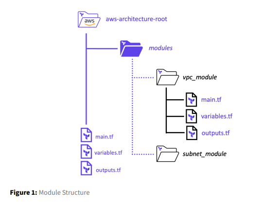

# Terraform Module block

- A `module` in `terraform` used to `combine different resources` that `generally used together` into a `reuseable container`

- `individual terraform module` used to `build the larger holistic solution` that required to deploy `application into the environment` 

- if we have a `larger application` which need `different type of infrasturure deployment` such as

    - `Azure`
    
    - `AWS` 
    
    - `GCP`

-  we can group all those `indivisual component` into different `indivisual terraform module` and call `all those different module` into `bigger holistic solutuion`

- the `main goal` while developing the `terraform module` is to make it more `reuseable` , so that it can be `reused` in `multiple different way` , which reduces the `number of code` that we may need to `develop`

- so in other wards , when we are `developing these module` , make sure , that you are using the `variable` everywhere in order to make it `more flexible as possible`

- hence we can pass `different values for the variable declared in the terraform module` so that it can create `different architecture` by `reusing the same module`

- `Terraform modules` are `called` by the `parent or root module` , any module the `parent module/root module` call is known as the `child modules`

- when we are using the `Terrform module` they can be `sourced` from `many different places` , this include using the `remote location` which is known as the `terraform module registry` i.e we can source the `terraform module` from `many different sources` such as `terraform module registry`

- we can also `develop and save `the `terraform module` locally and save them inside the `local folder`

- its not necessary required but commonly the `local terraform modules` are saved `locally` inside the `modules folder` , each `Terraform module file` inside the `modules` are refered by the `corresponding function that they want to perform` inside the `local folder`

- those `Terraform module files i.e the child module files` are basically developed by 
  
  - `main.tf`
  
  - `variables.tf`
  
  - `outouts.tf`

- by using the `outouts.tf` we can `export` the `data` from the `individual module`

- For Example

  - lets suppose we have the `VPC Terraform module` in order to create the `VPC` , then we can export the `VPC ID` or `other info about the VPC` from that `VPC Module` using the `output.tf` file 

  - we can then `import that VPC  module output data such as ID` into the `subnet module` in order to `create subnets`
  
  - plase find attach snipshot for reference 
  
  -  

- when we re creating the `Terraform module` then we need to define the `terraform module block` , each of the `module block` should have a `unique name` in order to reference

- inside the `Terraform module block` we need to define the `source` which can be
  
  - `local source path where the module being saved`
  
  - `remote source path where terraform will download the module` which can be `github repo` or `terraform module registry`   

- `You can also specify the version of the module to use`

- `along with that you can specify "inputs" that are passed to the child module` 

- The sampe `Terraform module template` can be written as below 

    
    ```tf
        module "<module_name>" { # defining the module block with the module name in this case

            #Block body
            source = <MODULE_SOURCE> # here we need to specify where the module being located 
            version = "<VERSION NUMBER>" # here defining the version of the module
            <INPUT_NAME> = <DESCRIPTION> #Inputs mentioned inside the modules
            <INPUT_NAME> = <DESCRIPTION> #Inputs mentioned inside the modules            

        }
    
    ```

- we can define the `Terraform module` as below for example

    
    ```tf
        aws-s3-static-website-bucket/main.tf
        ====================================
        module "website_s3_bucket" {
            
            source = "./modules/aws-s3-static-website-bucket" # defining the location of module that been defined in here
            bucket_name = var.s3_bucket_name # defining the bucket_name which can be coming from the varaible.tf which can be defined in the parent module
            aws_region = "us-east-1" # defining the aws_region over here which been statically defined 
            # here the bucket_name and aws_region is the input that we are poviding to the Terraform module in this case
            tags = { # defining the Tags in the form of key value pair in here
                
                Terraform = "true"
                Environment = "certification"

            }

        }

    ```

- **Lab14**
  
  -  Task 1: Create a `new module block ` to call a `remote module that store on the Terraform module registry`
  
  -  which can be used for `doing something with the subnet` that `accompolish something with the subnet`
  
  -  we can define the `Terraform module` as in here 

    ```tf
        
        main.tf # here as we are using the remote backend as the terraform module registry in this case hence we can define the value as in here  
        =======

        module "subnet_addrs" { # defining the module block with the module name in here 

            source = "hashicorp/subnet/cidr" # here defining the module which can be fetched from the Terraform module registry
            
            version = "1.0.0" # defining the version of the module in here 

            # these are the below input block we are using here

            base_cidr_block = "10.0.0.0/22" # defining the base_cidr_block in here 

            networks = [ # defining the Networks in here with the key value pair as an array 
                {
                    name = "module_network_a" # defining the name of the network over here
                    new_bits = 2 # defining the number_of_bits that will be added to the base_cidr_block in order to create a New Subnet block
                },
                {
                    name = "module_network_b" # defining the name of the network over here
                    new_bits = 2 # defining the number_of_bits that will be added to the base_cidr_block in order to create a New Subnet block
                }

            ]

        }

        output "subnet_addrs" { # defining the subnet block in here which will describe the output value in here 

            value = module.subnet_addrs.network_cidr_blocks # this will output the network subnet as the output in this case over here 

        }
    
    

    ```

    - when we use the `Terraform module` defined earlier then we can see that `this module` will `devide the base_cidr_block` ip adress into the `multiple subnets` over here 
    
    - on each `cidr_block` ip adress , `subnet mask` will be added with the `new_bits` value, in order to create `new subnet block` in this case over here 
    network_cidr_address
    
    - the `output block` will help in `outputting the exported data that we get from the module` in this case over here , we can also see those `export data` which been `stored in the output block` inside the `CLI` so that we can see the `result` what the `module has done for us`
    
    - as we are using the `A New Terraform module` , hence we need to make sure `Terraform should download the new module` , hence we need to run the `terraform init` command 
    
    - which will create the `.terraform` folder inside which we have the `module` and inside the `module` we can see out `subnet_addrs` module there 

    ```bash
        terraform init
        # this will download the module from the Terraform registry and provide the info mentioned in the main.tf file 
        # hence the output will be as below 

        Initializing the backend...
        Initializing modules...

        Initializing provider plugins...

        Terraform has been successfully initialized!

        You may now begin working with Terraform. Try running "terraform plan" to see
        any changes that are required for your infrastructure. All Terraform commands
        should now work.

        If you ever set or change modules or backend configuration for Terraform,
        rerun this command to reinitialize your working directory. If you forget, other
        commands will detect it and remind you to do so if necessary.
            
    ```

    - then we can run the command as `terraform apply -auto-approve` which will `call` the `respective module` and `feed that with the info provided` and `respective module will perform few thing with the info tht been provided` and `output data  will be exported to the parent module` and then we can use that `data exported` to the respective `terraform CLI` over here 
    
    - we can use the below script for the same 
    
    ```bash
        terraform apply -auto-approve # defining the terraform apply command over here 
        # here then we can see that it will take the ip address from the base_cidr_block and add the more_bits to the subnet mask of the cidr_block and then output the New Subnet with the subent mask in here 
        No changes. Your infrastructure matches the configuration.

        Terraform has compared your real infrastructure against your configuration and found no differences, so no changes are needed.

        Apply complete! Resources: 0 added, 0 changed, 0 destroyed.

        Outputs:

        subnet_addrs = tomap({
        "module_network_a" = "10.0.0.0/24" # this is the first subnet which being created after adding the more_bits to the subnet mask of the cidr_block
        "module_network_b" = "10.0.1.0/24" # this is the second subnet created after adding the more_bits to the subnet mask of the cidr_block
        })     
    

    ```

    - this will be helpful , if we are working on the `favourite cloud platform` or `on-prem` and need to split the `large cidr_block` into multiple `smaller subnets`
    
    - we can then deploy these `different different subnets` across the `public cloud` that we are using 
    
    - when we are `deploying these subnet` we can refer the `output exported data from the Terraform module thats been created` as the `input for the subnet` in here

