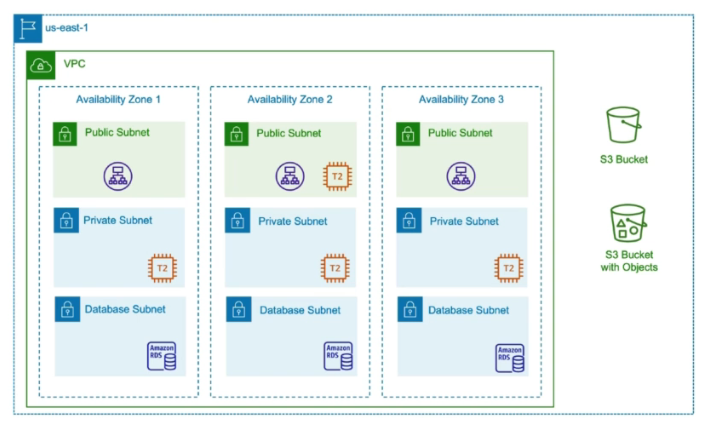

# Terraform Provider installtion 

- when we are using `Terraform` then tht will be `relies` on the `plugins` which is also known as the `providers`

- `Terraform providers` are the `Terraform` way to `interact` with the `remote system or remote platform` that gives `Terraform` , the ability to `easily expand the functionality` from the `Terraform core or Binaries` , as the new `remote platform and providers` are getting created 

- `Terraform configuration` must declared which `Terraform Providers` that it must use,so that `Terraform` can `install and use` that `Terraform provider` inside the `Terraform configuration`

- this can be perform by using the `Terraform configuration block` inside the `Terraform configuration`

- lets suppose our `Terraform infrastructure Architecture` as below 

  - 

  - we have the `AWS VPC` in which we have `multiple Availability Zone` i.e `multiple AZ's`
  
  - on each of the `AZ's` we have multiple `public subnet` , `private subnet` and `database subnets`
  
  - we have `databases` , `web tiers` , `load balancer` and `s3 buckets` in this case 
  
  - on top we can define which `Terraform version` we want to use and also specify `Terraform AWS provider` we want to use as well
  
  - this is important because `Terraform version` does not `incremented` like the `Terraform provider version`
  
  - lets suppose `hashicorp update the Terraform version` from `1.0.10` to `1.0.11` , but as the `Terraform AWS provider` developed in a `separate cadence schedule` which will not `necessaryly update `on the `same time hashicorp update the Terraform version`
  
  - even though the `Terraform version update` but the `Terraform AWS provider` will be on the `still remain on the same version`
  
  - but what happens if `Terraform AWS provider` updated rather than the `Terraform version` which `might break the change`
  
  - hence `while defining the Terraform version` we want to use in the `Terraform configuration block` we can also define the `Terrafrom AWS provider version` that we want to use 
  
  - in that way we can decide `when terraform will able to download and use the upgraded version of Terraform AWS provider` in the `production env`
  

- **Lab15**
  
  - we can run the `terraform version` in order to see `what version of the terraform being used`
  
  - we can use it as below 

    ```bash
        terraform version 
        # this will provide the terraform version that we are using 
        Terraform v1.6.3-dev
        on linux_amd64
        + provider registry.terraform.io/hashicorp/aws v5.23.1

        Your version of Terraform is out of date! The latest version
        is 1.6.3. You can update by downloading from https://www.terraform.io/downloads.html
            
    ```
  
  - we can create a `new directory` called `providers` as we are working with `Terraform providers` , inside that we can create a `terraform .tf`
  
  - we can define the `terraform.tf` as below 

    ```tf
        terraform.tf
        ============

        terraform {
            required_version = ">=0,15.0" # defining the terraform version that we are going to use
        }
    
    
    ```

    - now when we run the command as `terraform init` inside the `providers` folder then we can see the below input 
    
    ```bash
        cd providers/ # moving to the providers folder in  here 
        terraform init # using the terraform init which will perform the below thing
        # this will initialize the backend
        # this will also initialize the terraform provider (if any)
        # this will also initialize the Terraform version once both updated sucessfully
        # we can see the below output in that
        Initializing the backend...

        Initializing provider plugins...
        - Reusing previous version of hashicorp/aws from the dependency lock file
        - Using previously-installed hashicorp/aws v5.23.1

        Terraform has been successfully initialized!

        You may now begin working with Terraform. Try running "terraform plan" to see
        any changes that are required for your infrastructure. All Terraform commands
        should now work.

        If you ever set or change modules or backend configuration for Terraform,
        rerun this command to reinitialize your working directory. If you forget, other
        commands will detect it and remind you to do so if necessary.
    
    
    ```

    - which means the `Terraform version` we are using `matching the terraform configuation block` inside `terraform.tf`
    
    - as here we are using the `terraform 1.6.3` which is greater than the `terraform 1.0.0` hence it ius working 

    - but we can define the `terraform.tf` to a specific `version`  by defining as below 

    ```tf
        terraform.tf
        ============
        terraform {
            required_version = "=1.0.0" # here defining the terraform version exactly as 1.0.0 in here 
        }

    ```

    - now when run the `terraform init` inside the `providers` folder this will provide the `error` as the `our Terraform version doesnot match to the terraform version in the terraform configuration block`

    - here in that case we will be getting the output as below 

    ```bash
        cd providers/ # moving to the providers folder in  here 
        terraform init # using the terraform init which will perform the below thing
        Initializing the backend...
        ╷
        │ Error: Unsupported Terraform Core version
        │ 
        │   on terraform.tf line 2, in terraform:
        │    2:   required_version = "=1.0.0"
        │ 
        │ This configuration does not support Terraform version 1.6.3-dev. To proceed, either choose another supported Terraform version or update this version constraint. Version constraints
        │ are normally set for good reason, so updating the constraint may lead to other errors or unexpected behavior.
        ╵
    
    ```

    - here as the `Terraform configuration block` and `terraform version` not matching hence we are getting error in that case 

    - we can also spoecify the `required_version` as `~>` symbol means only the `minor version` will going to be get changed 
    
    - hence we can see the output as below 

    ```tf
        terraform.tf
        ============
        terraform {

            required_version = "~>1.6.0" # here defining the terraform version can be >1.6.<some version which will be higher>
            # anything that changes on the right most corner will be considered as the valid version
        }
    
    ```

    - now also if we ran the command then we can specify as below 

    ```bash
        cd providers/ # moving to the providers folder in  here 
        terraform init # using the terraform init which will perform the below thing
        # this will initialize the backend
        # this will also initialize the terraform provider (if any)
        # this will also initialize the Terraform version once both updated sucessfully
        # we can see the below output in that
        Initializing the backend...

        Initializing provider plugins...
        - Reusing previous version of hashicorp/aws from the dependency lock file
        - Using previously-installed hashicorp/aws v5.23.1

        Terraform has been successfully initialized!

        You may now begin working with Terraform. Try running "terraform plan" to see
        any changes that are required for your infrastructure. All Terraform commands
        should now work.

        If you ever set or change modules or backend configuration for Terraform,
        rerun this command to reinitialize your working directory. If you forget, other
        commands will detect it and remind you to do so if necessary.
    
    ```

    - the above `terraform version validation` will be veryu helpful , if we are running the `old terraform configuration` , we don't want to change that 
    
    - lets suppose we are running the `terraform version as 1.0.11` and with `terraform version upgraded to 1.0.12` there might be chance of `terraform configuration syntax` break then we can specify the `terraform configuration block`  to consider the version `required_version= "<=1.0.11"`

    - we can also validate the `specific version of Terraform Provider Version` along side the `Terraform version` as below
    
    - `Terraform` `might not` be `schedule to upgrade` based on the `Terraform Provider upgrade` , hence on the `production scenarion` we need to `define required version of Terraform and Terraform AWS provider`

    ```tf
        terraform.tf
        ============
        terraform {
            required_version = "~>1.6.0" # defining the version of the terraform required 
            required_providers {   # defining the required version of the Terraform Provider in this case over here

                aws = { # defining the aws module in here 

                    source = "hashicorp/aws" # defining the source as the terraform registry over here 

                    version = "~>5.23.0" # defining the required version of the Terraform AWS provider

                }

            }
        }
    
    
    ```

    - now when we ran the command as `terraform init` then it will try to `install` the `terraform provider` in this case as below 
    
    - it will `downloiad and use` the `Terraform provider version` that we have defined  
    
    - this will create the `.terraform` folder inside the `providers` module in this case over here  
    
    - if we want to `restrict the Terraform provider version` specific to the `production` then we can define that as `=<required version as below>` 

    - we can define that as below 

    ```tf
        terraform.tf
        ============
        terraform {
            required_version = "~>1.6.0" # defining the version of the terraform required 
            required_providers {   # defining the required version of the Terraform Provider in this case over here

                aws = { # defining the aws module in here 

                    source = "hashicorp/aws" # defining the source as the terraform registry over here 

                    version = "=5.23.0" # defining the required version of the Terraform AWS provider

                }

            }
        }
    
    
    ```

    ```bash
        cd providers/ # moving to the providers folder in  here 
        terraform init # using the terraform init which will perform the below thing
        # this will initialize the backend
        # this will also initialize the terraform provider (if any)
        # this will also initialize the Terraform version once both updated sucessfully
        # we can see the below output in that

        Initializing the backend...

        Initializing provider plugins...
        - Finding hashicorp/aws versions matching "5.23.0"...
        - Installing hashicorp/aws v5.23.0...
        - Installed hashicorp/aws v5.23.0 (signed by HashiCorp)

        Terraform has made some changes to the provider dependency selections recorded
        in the .terraform.lock.hcl file. Review those changes and commit them to your
        version control system if they represent changes you intended to make.

        Terraform has been successfully initialized!

        You may now begin working with Terraform. Try running "terraform plan" to see
        any changes that are required for your infrastructure. All Terraform commands
        should now work.

        If you ever set or change modules or backend configuration for Terraform,
        rerun this command to reinitialize your working directory. If you forget, other
        commands will detect it and remind you to do so if necessary.
    
    ```
    
    


