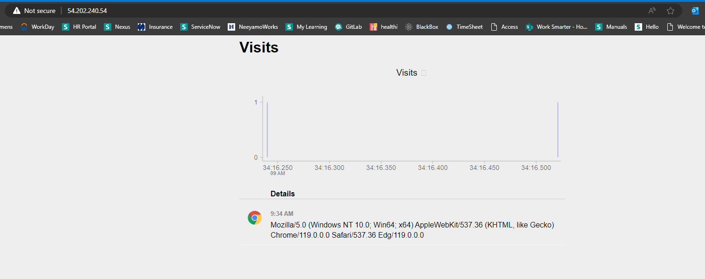

# Terraform Provisioners


- `Terraform Provisioners` can be `used to model specific actions ` on the `local machine` or on a `remote machine` in order to `prepare servers or other infrastructure objects `for `service`.


- To this point the `EC2 web server` we built living in one of the `public subnet` we have created is useless, We `created a server` `without` `any` `running code with no useful services are running on it`.


- this is just a `barebone of the operting system` running inside a `Virtual Machine`


- we will leverage the `Terraform Provisioner` to give this `EC2 web server` a `purpose` to `actually deploy an application` onto the `EC2 web server`


- before deploying the `application` onto the `EC2 web server` we will be using `security update` as well


- we will be using the `Terraform provisioner` to run the `security update` before deploying the `application` onto the `EC2 Web Sever`


- `Terraform` has number of `Terraform Provisioner` which can be used 
  
  - `local exec provisioner` which will `run the command locally`
  
  
  - `Remote Exec provisioner` which will `run the command on the remote Server such as EC2 virtual machine` to which `we want to connect`
  
  
  - `File Provisioner` which will allow us to `take` `any number of file off the machine`  which execute the `terraform apply -auto-approve` and upload to the `infrastructure` that it want to `provision` using the `Terraform configuration` 
  

-  **Lab01**
   
   - we first have to create an `AWS key pair` from `aws_key_pair` resource using the `public ssh key pair` from the `tls_private_key` terraform resource
   
   - by using the `public-ssh-key pair` inside the `AWS key pair` using which `Terraform` let to connect `to the Virtual Machine`
   
   - we need to use the `public ssh key` inside the `aws key pair` which will allow terraform to connect to the `Remote Virtual Machine`
   
   - for that we can define the `terraform configuration` as below 


    ```tf
        main.tf
        =======

        resource "tls_private_key" "private_my_key_pem" { # using the Terraform TLS provider in this case over here

            algorithm  = "RSA" # defining the type of Key which will be going to be get created is of RSA

            rsa_bits  = 4096   # defining the rsa_bits which will be used for the private_key which will be created   

        }

        resource "local_file" "file_name" { # here using the Terraform local Provider as the resource block in here

            content  = tls_private_key.private_my_key_pem.private_key_pem # setting the content of the file as the private key in the RSA fomat over here in the PEM file format

            filename = "myAWSKey.PEM" # setting the filename as the myAWSKey.PEM which will saved to the local directory in here 

        }

        resource "aws_key_pair" "my_key_pair" {

            key_name = "myAWSKey" # here we are providing the name of the AWS key pair key name which is same as the PEWm file we created earlier

            public_key = tls_private_key.private_my_key_pem.public_key_openssh # this will generate the public-key for the private key we have created  using the same Terraform TLS provider 

            # we can also validate the result in the output block as well as below 

            lifecycle { # here in the way of the lifecycle we can instruct Terraform to ignore the changes if someone made changes to the key_name argument , if someone changes the key_name the resource will not be destroyed and recreted 

                ignore_changes = [key_name] # ignoring the key_name ags in this case inside the resource block
            }

        }

    
    ```

- `Terraform Remote Exec Provisioner` will connect to the `Remote EC2 Server` using the command as `ssh connection`

- now we need to update the `EC2 Security group` to allow the `ssh connection` from the `Terraform Remote-Exec Provisioner` into `Remote EC2 instance`

- here we also want to deploy an `web apllication` from the `EC2 web server` instance as well , for which we also need to defined the `another security group` to allow that as well

- also we are defining the `aws security group` for the `icmp protocol` through which we can ping to the `EC2 instance` 

- hence we can update the `security group` as below in the `terraform configuration` as 

    ```tf
        main.tf
        =======
        resource "tls_private_key" "private_my_key_pem" { # using the Terraform TLS provider in this case over here

            algorithm  = "RSA" # defining the type of Key which will be going to be get created is of RSA

            rsa_bits  = 4096   # defining the rsa_bits which will be used for the private_key which will be created   

        }

        resource "local_file" "file_name" { # here using the Terraform local Provider as the resource block in here

            content  = tls_private_key.private_my_key_pem.private_key_pem # setting the content of the file as the private key in the RSA fomat over here in the PEM file format

            filename = "myAWSKey.PEM" # setting the filename as the myAWSKey.PEM which will saved to the local directory in here 

        }

        resource "aws_key_pair" "my_key_pair" {

            key_name = "myAWSKey" # here we are providing the name of the AWS key pair key name which is same as the PEWm file we created earlier

            public_key = tls_private_key.private_my_key_pem.public_key_openssh # this will generate the public-key for the private key we have created  using the same Terraform TLS provider 

            # we can also validate the result in the output block as well as below 

            lifecycle { # here in the way of the lifecycle we can instruct Terraform to ignore the changes if someone made changes to the key_name argument , if someone changes the key_name the resource will not be destroyed and recreted 

                ignore_changes = [key_name] # ignoring the key_name ags in this case inside the resource block
            }

        }

        resource "aws_security_group" "vpc_ssh" { # creating the aws_security_group in this case over here as below 

            name = "vpc_ssh_connection"

            description = "Security Group for SSH connection onto the Remote SSH"

            vpc_id = aws_vpc.vpc.id # getting the vpc_id using the vpc_id in this case by referencing the aws_vpc resource

            ingress { # definign the ingress rue for the same 

                from_port = 22 # opening the port 22 for the SSH connection
                
                to_port = 22 # opening the pot 22 for SSH connection

                protocol = "tcp" # defining the protocol as TCP in this case

                cidr_blocks = ["0.0.0.0/0"] # defining the cidr_block in this case out in here 

            }

            egress { # defining the egress rule for the aws_security_group which will overide the default one over here

                from_port = 0 # here allowing all the port to the destination as outbound

                to_port = 0 # here allowing all the port to the destination as outbound

                protocol = "-1" # here -1 signifies that all protocol will be allowed 

                cidr_blocks = ["0.0.0.0/0"] # defining the cidr_block in this case out in here 

            }

        }

        # similarly we need to define another aws_security_group which will allow web connection hence we need to open the port 80 and 443 for the same 

        resource "aws_security_group" "vpc_web" { # defining the aws_security_group resource allowing the web connection as below 

            name = "vpc_web_connection"

            description = "Security Group for HTTP and HTTPS connection onto the Remote EC2"

            vpc_id = aws_vpc.vpc.id # referencing the vpc over in here for the aws_vpc

            ingress { # defining the ingress rule for the http port 

                from_port = 80 # defining the from_port destination for the inbound

                to_port = 80 # defining the to_port in here destination for the inbound

                protocol = "tcp" # allowing the tcp protocol over here 

                cidr_blocks = ["0.0.0.0/0"] # defining the cidr_block to allow all the connection as inbound 

            }

            ingresss { # defining the ingress rule for the https port 

                from_port = 443 # opening th port 443 for https connection 

                to_port = 443 # opening the port 443 for https connection

                protocol = "tcp" # defining the protocol as tcp in here 

                cidr_blocks = ["0.0.0.0/0 "] # allowing all the port for incoming https connection

            }

            # this will overide the default outboud rule of the security group

            egress { # defining the egress rule for the outbound connection 

                from_port = 0 # defining for all the port as allowed

                to_port = 0 # defining for all the to port as allowed

                protocol = "-1" # here -1 signifies all the protocols are being allowed in thsi case 

                cidr_blocks = ["0.0.0.0/0"] # allowing all the port for the outgoing connection


            }

        }
    
    
        resource "aws_security_group" "vpc_ping" { # defining another security group group in order to implement ping mechanisim using the ICMP internet connectivity network protocol

            name = "vpc_ping_connection" # defining the name for the security group

            description = "Security Group to implement the Ping Mechannism"

            vpc_id = aws_vpc.vpc.id # here providing reference to the vpc in here 

            ingress { # defining the ingress rule in here 

                from_port = -1 #in case of protocol as icmp the port -1 means its irrelevant as we are using the icmp and any port range will be allowed 

                to_port = -1 # in case of protocol as icmp the port -1 means its irrelevant as we are using the icmp and any port range will be allowed 

                protocol = "icmp" # defining the protocol as icmp for the ping mechanism over here 

                cidr_blocks = ["0.0.0.0/0"] # allowing any ip to come as inbound service 

            } 

            egress { # defining the egress rule for the outbound connection

                from_port = 0 # allowing all the ports as the outbound 

                to_port = 0 # allowing all the ports as the outbound 

                protocol = "-1" # allowing all the protocol by specifying as -1 

                cidr_blocks = ["0.0.0.0/0"] # defining the cidr_block to allow the IP address for the same 


            }


        }
    

    
    ```
- now we need to associate the `aws_key_pair` resource that we have created to the `aws_instance` resource

- also we need to specify the `security group` that we have created to the `EC2` instance that we have made 

- then we need to make a `connection block` using which the connection will be established between the `Terraform` and `AWS EC2 instance`
  
  - here we need to make use of the `username` of the `EC2 Instance`
  
  - we also need to have the `public_ip` of the `EC2 instance` in order to connect 
  
  - we can then declare the `authentication scheme` as the `private key`  that we have saved to the `localfile` using the `Terraform Local Provider`
  
- we need to ensure that the `connction block` must always be created inside the `resource block` that we are using in thsi case over here 

- we can define that as below 

    ```tf
        main.tf
        =======

        provider "aws" { # defining the provider as AWS in this case

            region = "us-west-2" # defining the region as us-west-2 in here

        }

        data "aws_availability_zones" "available" {}   #defining the availablity zone out in here in the data block to query the backend API

        
        resource "aws_vpc" "vpc" { # defining the aws_vpc as the resource with name as vpc

            cidr_block = var.vpc_cidr # defining the cidr_block from the varibles.tf file

            tags = { # defining the tags in which will be displayed in AWS Managenment console
                
                Terraform = "true" # defining the Tags in here as Terraform = "true"

            } 


        }

        resource "aws_subnet" "public_subnet" { # defining the aws subnet over here as public subnet

            for_each = var.public_subnet # defining the variable as public subnet in here 

            vpc_id = aws_vpc.vpc.id # referencing the vpc over here as the resource block we created 

            cidr_block = cidrsubnet(var.vpc_cidr,8, each,value) # here defining the cidr_block for the aws_subnet in here 

            availability_zone = tolist(data.aws_availability_zones.available.names) # defining the tolist function on order to define the availablity zone that being defined on the dta resource 

            tags = { # defining the Tags for the aws_subnet as in this case over here

                Terraform = "true" # defining the key-value pair for the tags in this case 

            }

        }

        resource "aws_subnet" "private_subnet" {

            for_each = var.public_subnet # defining the variable as public subnet in here 

            vpc_id = aws_vpc.vpc.id # referencing the vpc over here as the resource block we created 

            cidr_block = cidrsubnet(var.vpc_cidr,8, each,value + 100) # here defining the cidr_block for the aws_subnet in here 

            availability_zone = tolist(data.aws_availability_zones.available.names) # defining the tolist function on order to define the availablity zone that being defined on the dta resource 

            tags = { # defining the Tags for the aws_subnet as in this case over here

                Terraform = "true" # defining the key-value pair for the tags in this case 

            }

        }

        resource "aws_internet_gateway" "internet_gateway" { # defining the internet gateway for reference 

            vpc_id = aws_vpc.vpc.id # defining the vpc which it try to reference

            tags = { # defining the tags for the same 

                Name = "internet_gateway"
            
            }
            
        
        }

        resource "aws_eip" "demo_eip" { # defining the EIP which need to associate with the NAT gateway for the private subnet

            domain  = "vpc" # defining the domain as vpc in this case 

            depends_on = [aws_internet_gateway.internet_gateway] # defining the EIP depends on the internet gateway which need to be created first

            tags = {

                Terraform = "true"

            }


        }

        resource "aws_nat_gateway" "demo_nat_gateway" { # defining the NAT Gateway for reference

            depends_on = [aws_subnet.public_subnet] # it depends on the public subnet as we are associating the NAT way to the public subnet 

            allocation_id= aws_eip.demo_eip.id # associating the EIP with the NAT gateway
            
            subnet_id = aws_subnet.public_subnet["public_subnet_1"].id # defining the NAT Gatway asociated to the public subnet

            
            tags = {
                
                Name = "gw NAT"
            }
        
        }


        resource "aws_route_table" "public_route_table" { # defining the route table for the public subnet

            vpc_id = aws_vpc.vpc.id # fetching the vpc_id from referenced VPC

            route { # defining the route for th route table

                cidr_block = "0.0.0.0/0" # allowing all the traffic in here
                gateway_id = aws_internet_gateway.internet_gateway.id # redirect to the internet gateway

            }

        }


        resource "aws_route_table" "private_route_table" {

            vpc_id = aws_vpc.vpc.id # fetching the vpc_id from referenced VPC

            route { # defining the route for th route table

                cidr_block = "0.0.0.0/0" #allowing all the traffic in here
                gateway_id = aws_nat_gateway.demo_nat_gateway.id # redirect to the NAT gateway

            }

        }

        resource "aws_route_table_association" "public_route_association" { # associating the public route table with all the public_subnet in this case 

            depends_on     = [aws_subnet.public_subnet] # first the public_subnet should be created followed by the aws_route_table_association
            for_each       = aws_subnet.public_subnet # for every public subnet 
            subnet_id      = each.value.id # fetching the subnet_id for ech of the public subnet
            route_table_id = aws_route_table.public_route_table.id # associating the route table with the public subnet which will redirect to internet gateway due to  aws_public_route table
        
        }

        resource "aws_route_table_association" "private_route_association" { # associating the private route table with all the public_subnet in this case 

            depends_on     = [aws_subnet.private_subnet] # defining that private_subnet should be create first
            for_each       = aws_subnet.private_subnet # for every private_subnet
            subnet_id      = each.value.id # fetching the subnet id
            route_table_id = aws_route_table.private_route_table.id # associating it with the private_route_table which will redirect to the NAT gatway
        
        }


        resource "tls_private_key" "private_my_key_pem" { # using the Terraform TLS provider in this case over here

            algorithm  = "RSA" # defining the type of Key which will be going to be get created is of RSA

            rsa_bits  = 4096   # defining the rsa_bits which will be used for the private_key which will be created   

        }

        resource "local_file" "file_name" { # here using the Terraform local Provider as the resource block in here

            content  = tls_private_key.private_my_key_pem.private_key_pem # setting the content of the file as the private key in the RSA fomat over here in the PEM file format

            filename = "myAWSKey.PEM" # setting the filename as the myAWSKey.PEM which will saved to the local directory in here 

        }

        resource "aws_key_pair" "my_key_pair" {

            key_name = "myAWSKey" # here we are providing the name of the AWS key pair key name which is same as the PEWm file we created earlier

            public_key = tls_private_key.private_my_key_pem.public_key_openssh # this will generate the public-key for the private key we have created  using the same Terraform TLS provider 

            # we can also validate the result in the output block as well as below 

            lifecycle { # here in the way of the lifecycle we can instruct Terraform to ignore the changes if someone made changes to the key_name argument , if someone changes the key_name the resource will not be destroyed and recreted 

                ignore_changes = [key_name] # ignoring the key_name ags in this case inside the resource block
            }

        }

        resource "aws_security_group" "vpc_ssh" { # creating the aws_security_group in this case over here as below 

            name = "vpc_ssh_connection"

            description = "Security Group for SSH connection onto the Remote SSH"

            vpc_id = aws_vpc.vpc.id # getting the vpc_id using the vpc_id in this case by referencing the aws_vpc resource

            ingress { # definign the ingress rue for the same 

                from_port = 22 # opening the port 22 for the SSH connection
                
                to_port = 22 # opening the pot 22 for SSH connection

                protocol = "tcp" # defining the protocol as TCP in this case

                cidr_blocks = ["0.0.0.0/0"] # defining the cidr_block in this case out in here 

            }

            egress { # defining the egress rule for the aws_security_group which will overide the default one over here

                from_port = 0 # here allowing all the port to the destination as outbound

                to_port = 0 # here allowing all the port to the destination as outbound

                protocol = "-1" # here -1 signifies that all protocol will be allowed 

                cidr_blocks = ["0.0.0.0/0"] # defining the cidr_block in this case out in here 

            }

        }

        # similarly we need to define another aws_security_group which will allow web connection hence we need to open the port 80 and 443 for the same 

        resource "aws_security_group" "vpc_web" { # defining the aws_security_group resource allowing the web connection as below 

            name = "vpc_web_connection"

            description = "Security Group for HTTP and HTTPS connection onto the Remote EC2"

            vpc_id = aws_vpc.vpc.id # referencing the vpc over in here for the aws_vpc

            ingress { # defining the ingress rule for the http port 

                from_port = 80 # defining the from_port destination for the inbound

                to_port = 80 # defining the to_port in here destination for the inbound

                protocol = "tcp" # allowing the tcp protocol over here 

                cidr_blocks = ["0.0.0.0/0"] # defining the cidr_block to allow all the connection as inbound 

            }

            ingresss { # defining the ingress rule for the https port 

                from_port = 443 # opening th port 443 for https connection 

                to_port = 443 # opening the port 443 for https connection

                protocol = "tcp" # defining the protocol as tcp in here 

                cidr_blocks = ["0.0.0.0/0 "] # allowing all the port for incoming https connection

            }

            # this will overide the default outboud rule of the security group

            egress { # defining the egress rule for the outbound connection 

                from_port = 0 # defining for all the port as allowed

                to_port = 0 # defining for all the to port as allowed

                protocol = "-1" # here -1 signifies all the protocols are being allowed in thsi case 

                cidr_blocks = ["0.0.0.0/0"] # allowing all the port for the outgoing connection


            }

        }
    
    
        resource "aws_security_group" "vpc_ping" { # defining another security group group in order to implement ping mechanisim using the ICMP internet connectivity network protocol

            name = "vpc_ping_connection" # defining the name for the security group

            description = "Security Group to implement the Ping Mechannism"

            vpc_id = aws_vpc.vpc.id # here providing reference to the vpc in here 

            ingress { # defining the ingress rule in here 

                from_port = -1 #in case of protocol as icmp the port -1 means its irrelevant as we are using the icmp and any port range will be allowed 

                to_port = -1 # in case of protocol as icmp the port -1 means its irrelevant as we are using the icmp and any port range will be allowed 

                protocol = "icmp" # defining the protocol as icmp for the ping mechanism over here 

                cidr_blocks = ["0.0.0.0/0"] # allowing any ip to come as inbound service 

            } 

            egress { # defining the egress rule for the outbound connection

                from_port = 0 # allowing all the ports as the outbound 

                to_port = 0 # allowing all the ports as the outbound 

                protocol = "-1" # allowing all the protocol by specifying as -1 

                cidr_blocks = ["0.0.0.0/0"] # defining the cidr_block to allow the IP address for the same 


            }


        }

        # now here we can define the data block to query the ubuntu instance as below 

        data "aws_ami" "ubuntu" { # creating the aws_ami in order to query and get the mai address

            most_recent      = true # if there were multiple ami then the latest one will be considered
            owners           = ["amazon"] # defining the owner as amazon define in terraform registry

            filter { # defining the filter with name value pair in order to filter the query over here 
                
                name = "name"
                value = ["ubuntu/images/hvm-ssd/ubuntu-jammy-22.04-amd64-server-*"]

            }
            filter { # defining the filter with name value pair
                
                name = "virtualization-type"
                value = ["hvm"]

            }

        }

        resource "aws_instance" "ubuntu_server" {
            
            ami = data.aws_ami.ubuntu.id # here referencing the data block to fetch the ami id in this case 

            instance_type = "t2.micro" # defining the instance_type in this case out in here 

            subnet_id = aws_subnet.public_subnet["public_subnet_1"].id # fetching the public subnet in this case out in here 

            security_groups = [aws_security_group.vpc_ping.id , aws_security_group.vpc_ssh.id , aws_security_group.vpc_web.id ]

            # associating the security group in this case over here 

            key_name = aws_key_pair.my_key_pair.key_name

            # associating the aws_key_pair to the AWS EC2 instance in here through the key_name args in this case 

            connection { #defining the connection bblock in order to connect to the Remote-Exec Terraform provisioner to the Remote EC2 instance to execute some command 

                user = "ubuntu" # defining the user as the ubuntu in this case 
                
                private_key = local_file.file_name.filename # refencing the Terraform local Provider block in here 

                public_ip = self.public_ip # defining the public_ip in this case over here 

            }

        
        }


    ```

- defining the `input variable` inside the `variables.tf` as below 

    ```tf
        variables.tf
        ============

        variable "vpc_cidr" {

            type = string # defining the type as string in this case 

            description = "Defined CIDR IP address in here " # providign th description for the variable over here

            default = "10.0.0.0/16" # defining the default value in this case out in here 

        }
    
        variable "public_subnet"{ # defining the public subnet variable in here 

            default = { # defining the default value for the public subnet in this case as 

                "public_subnet_1" = 1
                "public_subnet_2" = 2
                "public_subnet_3" = 3 

            }

        }

        variable "private_subnet"{ # defining the private subnet variable in here 

            default = { # defining the default value for the private subnet in this case as 

                "private_subnet_1" = 1
                "private_subnet_2" = 2
                "private_subnet_3" = 3 

            }

        }

    
    ```

- now as we are all set `we can define` the `terraform local exec provisioner` in this case , which will going to execute the command `locally` where the `terraform apply -auto-approve` been issued i.e the local terminal 

- the `local exec Terraform Provisioner` will be executed after the `resource being created` but will be execued in the `terraform apply issuer terminal` i.e `local command in the terminal` 

- but the `Terraform Remote exec provisioner` will executed in the `Remote EC2 instance` after it connected to the `EC2 instnce or Remote Server` using the `private authentication scheme` over the `SSH` which allowed by the `AWS security group`

- all the provisioner will be a part of the `Resource block` like the `connection block` that we have defined

- we can define the `local-exec Terraform provisioner` which will update the `PEM file` to a particular `User -Group Access` using the `chmod` command 

- we will be defining the `remote Exec Terraform Provisioner` which will be executed in the `Remote-Ec2 instance` after the ssh connection been made successful as below 

- we can define the `single line command` using it as the `command` platform and `multiple command` executed using the `inline` args with the `list of command` separated by `comma` 

- we can define the `local-exec Terraform Provisioner` and `remote-exec Terraform Provisioner` as below 

    
    ```tf
        main.tf
        =======
        provider "aws" { # defining the provider as AWS in this case

            region = "us-west-2" # defining the region as us-west-2 in here

        }

        data "aws_availability_zones" "available" {}   #defining the availablity zone out in here in the data block to query the backend API

        
        resource "aws_vpc" "vpc" { # defining the aws_vpc as the resource with name as vpc

            cidr_block = var.vpc_cidr # defining the cidr_block from the varibles.tf file

            tags = { # defining the tags in which will be displayed in AWS Managenment console
                
                Terraform = "true" # defining the Tags in here as Terraform = "true"

            } 


        }

        resource "aws_subnet" "public_subnet" { # defining the aws subnet over here as public subnet

            for_each = var.public_subnet # defining the variable as public subnet in here 

            vpc_id = aws_vpc.vpc.id # referencing the vpc over here as the resource block we created 

            cidr_block = cidrsubnet(var.vpc_cidr,8, each.value) # here defining the cidr_block for the aws_subnet in here 

            availability_zone = tolist(data.aws_availability_zones.available.names) # defining the tolist function on order to define the availablity zone that being defined on the dta resource 

            map_public_ip_on_launch = true # mapping the public_ip when the subnet being launched
            
            tags = { # defining the Tags for the aws_subnet as in this case over here

                Terraform = "true" # defining the key-value pair for the tags in this case 

            }

        }

        resource "aws_subnet" "private_subnet" {

            for_each = var.public_subnet # defining the variable as public subnet in here 

            vpc_id = aws_vpc.vpc.id # referencing the vpc over here as the resource block we created 

            cidr_block = cidrsubnet(var.vpc_cidr,8, each,value + 100) # here defining the cidr_block for the aws_subnet in here 

            availability_zone = tolist(data.aws_availability_zones.available.names) # defining the tolist function on order to define the availablity zone that being defined on the dta resource 

            tags = { # defining the Tags for the aws_subnet as in this case over here

                Terraform = "true" # defining the key-value pair for the tags in this case 

            }

        }


        resource "aws_internet_gateway" "internet_gateway" { # defining the internet gateway for reference 

            vpc_id = aws_vpc.vpc.id # defining the vpc which it try to reference

            tags = { # defining the tags for the same 

                Name = "internet_gateway"
            
            }
            
        
        }

        resource "aws_eip" "demo_eip" { # defining the EIP which need to associate with the NAT gateway for the private subnet

            domain  = "vpc" # defining the domain as vpc in this case 

            depends_on = [aws_internet_gateway.internet_gateway] # defining the EIP depends on the internet gateway which need to be created first

            tags = {

                Terraform = "true"

            }


        }

        resource "aws_nat_gateway" "demo_nat_gateway" { # defining the NAT Gateway for reference

            depends_on = [aws_subnet.public_subnet] # it depends on the public subnet as we are associating the NAT way to the public subnet 

            allocation_id= aws_eip.demo_eip.id # associating the EIP with the NAT gateway
            
            subnet_id = aws_subnet.public_subnet["public_subnet_1"].id # defining the NAT Gatway asociated to the public subnet

            
            tags = {
                
                Name = "gw NAT"
            }
        
        }


        resource "aws_route_table" "public_route_table" { # defining the route table for the public subnet

            vpc_id = aws_vpc.vpc.id # fetching the vpc_id from referenced VPC

            route { # defining the route for th route table

                cidr_block = "0.0.0.0/0" # allowing all the traffic in here
                gateway_id = aws_internet_gateway.internet_gateway.id # redirect to the internet gateway

            }

        }


        resource "aws_route_table" "private_route_table" {

            vpc_id = aws_vpc.vpc.id # fetching the vpc_id from referenced VPC

            route { # defining the route for th route table

                cidr_block = "0.0.0.0/0" #allowing all the traffic in here
                gateway_id = aws_nat_gateway.demo_nat_gateway.id # redirect to the NAT gateway

            }

        }

        resource "aws_route_table_association" "public_route_association" { # associating the public route table with all the public_subnet in this case 

            depends_on     = [aws_subnet.public_subnet] # first the public_subnet should be created followed by the aws_route_table_association
            for_each       = aws_subnet.public_subnet # for every public subnet 
            subnet_id      = each.value.id # fetching the subnet_id for ech of the public subnet
            route_table_id = aws_route_table.public_route_table.id # associating the route table with the public subnet which will redirect to internet gateway due to
        
        }

        resource "aws_route_table_association" "private_route_association" { # associating the private route table with all the public_subnet in this case 

            depends_on     = [aws_subnet.private_subnet] # defining that private_subnet should be create first
            for_each       = aws_subnet.private_subnet # for every private_subnet
            subnet_id      = each.value.id # fetching the subnet id
            route_table_id = aws_route_table.private_route_table.id # associating it with the private_route_table which will redirect to the NAT gatway
        
        }


        resource "tls_private_key" "private_my_key_pem" { # using the Terraform TLS provider in this case over here

            algorithm  = "RSA" # defining the type of Key which will be going to be get created is of RSA

            rsa_bits  = 4096   # defining the rsa_bits which will be used for the private_key which will be created   

        }

        resource "local_file" "file_name" { # here using the Terraform local Provider as the resource block in here

            content  = tls_private_key.private_my_key_pem.private_key_pem # setting the content of the file as the private key in the RSA fomat over here in the PEM file format

            filename = "myAWSKey.PEM" # setting the filename as the myAWSKey.PEM which will saved to the local directory in here 

        }

        resource "aws_key_pair" "my_key_pair" {

            key_name = "myAWSKey" # here we are providing the name of the AWS key pair key name which is same as the PEWm file we created earlier

            public_key = tls_private_key.private_my_key_pem.public_key_openssh # this will generate the public-key for the private key we have created  using the same Terraform TLS provider 

            # we can also validate the result in the output block as well as below 

            lifecycle { # here in the way of the lifecycle we can instruct Terraform to ignore the changes if someone made changes to the key_name argument , if someone changes the key_name the resource will not be destroyed and recreted 

                ignore_changes = [key_name] # ignoring the key_name ags in this case inside the resource block
            }

        }

        resource "aws_security_group" "vpc_ssh" { # creating the aws_security_group in this case over here as below 

            name = "vpc_ssh_connection"

            description = "Security Group for SSH connection onto the Remote SSH"

            vpc_id = aws_vpc.vpc.id # getting the vpc_id using the vpc_id in this case by referencing the aws_vpc resource

            ingress { # definign the ingress rue for the same 

                from_port = 22 # opening the port 22 for the SSH connection
                
                to_port = 22 # opening the pot 22 for SSH connection

                protocol = "tcp" # defining the protocol as TCP in this case

                cidr_blocks = ["0.0.0.0/0"] # defining the cidr_block in this case out in here 

            }

            egress { # defining the egress rule for the aws_security_group which will overide the default one over here

                from_port = 0 # here allowing all the port to the destination as outbound

                to_port = 0 # here allowing all the port to the destination as outbound

                protocol = "-1" # here -1 signifies that all protocol will be allowed 

                cidr_blocks = ["0.0.0.0/0"] # defining the cidr_block in this case out in here 

            }

        }

        # similarly we need to define another aws_security_group which will allow web connection hence we need to open the port 80 and 443 for the same 

        resource "aws_security_group" "vpc_web" { # defining the aws_security_group resource allowing the web connection as below 

            name = "vpc_web_connection"

            description = "Security Group for HTTP and HTTPS connection onto the Remote EC2"

            vpc_id = aws_vpc.vpc.id # referencing the vpc over in here for the aws_vpc

            ingress { # defining the ingress rule for the http port 

                from_port = 80 # defining the from_port destination for the inbound

                to_port = 80 # defining the to_port in here destination for the inbound

                protocol = "tcp" # allowing the tcp protocol over here 

                cidr_blocks = ["0.0.0.0/0"] # defining the cidr_block to allow all the connection as inbound 

            }

            ingress { # defining the ingress rule for the https port 

                from_port = 443 # opening th port 443 for https connection 

                to_port = 443 # opening the port 443 for https connection

                protocol = "tcp" # defining the protocol as tcp in here 

                cidr_blocks = ["0.0.0.0/0"] # allowing all the port for incoming https connection

            }

            # this will overide the default outboud rule of the security group

            egress { # defining the egress rule for the outbound connection 

                from_port = 0 # defining for all the port as allowed

                to_port = 0 # defining for all the to port as allowed

                protocol = "-1" # here -1 signifies all the protocols are being allowed in thsi case 

                cidr_blocks = ["0.0.0.0/0"] # allowing all the port for the outgoing connection


            }

        }
    
    
        resource "aws_security_group" "vpc_ping" { # defining another security group group in order to implement ping mechanisim using the ICMP internet connectivity network protocol

            name = "vpc_ping_connection" # defining the name for the security group

            description = "Security Group to implement the Ping Mechannism"

            vpc_id = aws_vpc.vpc.id # here providing reference to the vpc in here 

            ingress { # defining the ingress rule in here 

                from_port = -1 #in case of protocol as icmp the port -1 means its irrelevant as we are using the icmp and any port range will be allowed 

                to_port = -1 # in case of protocol as icmp the port -1 means its irrelevant as we are using the icmp and any port range will be allowed 

                protocol = "icmp" # defining the protocol as icmp for the ping mechanism over here 

                cidr_blocks = ["0.0.0.0/0"] # allowing any ip to come as inbound service 

            } 

            egress { # defining the egress rule for the outbound connection

                from_port = 0 # allowing all the ports as the outbound 

                to_port = 0 # allowing all the ports as the outbound 

                protocol = "-1" # allowing all the protocol by specifying as -1 

                cidr_blocks = ["0.0.0.0/0"] # defining the cidr_block to allow the IP address for the same 


            }


        }

        # now here we can define the data block to query the ubuntu instance as below 

        data "aws_ami" "ubuntu" { # creating the aws_ami in order to query and get the mai address

            most_recent      = true # if there were multiple ami then the latest one will be considered
            owners           = ["amazon"] # defining the owner as amazon define in terraform registry

            filter { # defining the filter with name values pair in order to filter the query over here 
                
                name = "name"
                values = ["ubuntu/images/hvm-ssd/ubuntu-jammy-22.04-amd64-server-*"]

            }
            filter { # defining the filter with name value pair
                
                name = "virtualization-type"
                values = ["hvm"]

            }

        }

        resource "aws_instance" "ubuntu_server" {
            
            ami = data.aws_ami.ubuntu.id # here referencing the data block to fetch the ami id in this case 

            instance_type = "t2.micro" # defining the instance_type in this case out in here 

            subnet_id = aws_subnet.public_subnet["public_subnet_1"].id # fetching the public subnet in this case out in here 

            security_groups = [aws_security_group.vpc_ssh.id]

            # associating the security group in this case over here 

            associate_public_ip_address = true # we need to associate the public_key on creation as well in this case 

            key_name = aws_key_pair.my_key_pair.key_name

            # associating the aws_key_pair to the AWS EC2 instance in here through the key_name args in this case 

            connection { #defining the connection bblock in order to connect to the Remote-Exec Terraform provisioner to the Remote EC2 instance to execute some command 

                user = "ubuntu" # defining the user as the ubuntu in this case 
                
                private_key = tls_private_key.private_my_key_pem.private_key_pem  # refencing the Terraform TLS Provider block in here 

                host = self.public_ip # defining the public_ip in this case over here as the host which is required params

            }

            # defining the Terraform Provisioner inside the Resource block of aws_instance in this case out in here

            provisioner "local-exec" { # defining the provisioner as the local-exec Terraform provisioner 

                command = "chmod 600  ${local_file.file_name.filename}"  # defining the command to change the Access for the PEM key to 600


            }

            provisioner "remote-exec" { # defining the provisioner as the remote-exec provisioner in this case as below 

                inline = [
                    
                    "sudo rm -rf /tmp", # removing the tmp folder in this case over here 
                    
                    "sudo git clone https://github.com/hashicorp/demo-terraform-101 /tmp", # copy the git repo to the /tmp folder in here 
                    
                    "sudo sh /tmp/assets/setup-web.sh" # executing the bash file to generate the web platform

                ]


            }

        
        }

    
        
    
    ```

- now we can run the `terraform fmt` in order to format the `Terraform configuration`

- we can run the `terraform validate` in order to validate the `configuration`

- we can then run the `terraform plan` in order to see the `execution plan`

- we then have have to run the `terraform apply -auto-approve` in order to deploy infrastructure to  `AWS in here 

- we can see the output of the below command in here as 

    ```bash
        
        terraform fmt # running the terraform fmt to format the Terraform configuration in this case
        # the output in this case will be as below 
        main.tf
        terraform.tf
        # which means the Terraform configuration file along with the variables file are now being formatted

        # now we can define the terraform validate to validte `main.tf` file as below 
        terraform validate 
        # fetching the terraform validate output in this case 
        Success! The configuration is valid. 

        # fetching the terraform plan in order to see the execution plan for the same 
        terraform plan # checking the plan for the Terraform as 
        # below will be the output for the same
        data.aws_availability_zones.available: Reading...
        data.aws_region.current: Reading...
        data.aws_ami.ubuntu: Reading...
        data.aws_region.current: Read complete after 0s [id=us-west-2]
        data.aws_availability_zones.available: Read complete after 2s [id=us-west-2]
        data.aws_ami.ubuntu: Read complete after 2s [id=ami-079167f081a690d5a]

        Terraform used the selected providers to generate the following execution plan. Resource actions are indicated with the following symbols:
        + create

        Terraform will perform the following actions:

        # aws_eip.demo_eip will be created
        + resource "aws_eip" "demo_eip" {
            + allocation_id        = (known after apply)
            + association_id       = (known after apply)
            + carrier_ip           = (known after apply)
            + customer_owned_ip    = (known after apply)
            + domain               = "vpc"
            + id                   = (known after apply)
            + instance             = (known after apply)
            + network_border_group = (known after apply)
            + network_interface    = (known after apply)
            + private_dns          = (known after apply)
            + private_ip           = (known after apply)
            + public_dns           = (known after apply)
            + public_ip            = (known after apply)
            + public_ipv4_pool     = (known after apply)
            + tags                 = {
                + "Terraform" = "true"
                }
            + tags_all             = {
                + "Terraform" = "true"
                }
            + vpc                  = (known after apply)
            }

        # aws_instance.ubuntu_server will be created
        + resource "aws_instance" "ubuntu_server" {
            + ami                                  = "ami-079167f081a690d5a"
            + arn                                  = (known after apply)
            + associate_public_ip_address          = true
            + availability_zone                    = (known after apply)
            + cpu_core_count                       = (known after apply)
            + cpu_threads_per_core                 = (known after apply)
            + disable_api_stop                     = (known after apply)
            + disable_api_termination              = (known after apply)
            + ebs_optimized                        = (known after apply)
            + get_password_data                    = false
            + host_id                              = (known after apply)
            + host_resource_group_arn              = (known after apply)
            + iam_instance_profile                 = (known after apply)
            + id                                   = (known after apply)
            + instance_initiated_shutdown_behavior = (known after apply)
            + instance_lifecycle                   = (known after apply)
            + instance_state                       = (known after apply)
            + instance_type                        = "t2.micro"
            + ipv6_address_count                   = (known after apply)
            + ipv6_addresses                       = (known after apply)
            + key_name                             = "myAWSKey"
            + monitoring                           = (known after apply)
            + outpost_arn                          = (known after apply)
            + password_data                        = (known after apply)
            + placement_group                      = (known after apply)
            + placement_partition_number           = (known after apply)
            + primary_network_interface_id         = (known after apply)
            + private_dns                          = (known after apply)
            + private_ip                           = (known after apply)
            + public_dns                           = (known after apply)
            + public_ip                            = (known after apply)
            + secondary_private_ips                = (known after apply)
            + security_groups                      = (known after apply)
            + source_dest_check                    = true
            + spot_instance_request_id             = (known after apply)
            + subnet_id                            = (known after apply)
            + tags_all                             = (known after apply)
            + tenancy                              = (known after apply)
            + user_data                            = (known after apply)
            + user_data_base64                     = (known after apply)
            + user_data_replace_on_change          = false
            + vpc_security_group_ids               = (known after apply)
            }

        # aws_internet_gateway.internet_gateway will be created
        + resource "aws_internet_gateway" "internet_gateway" {
            + arn      = (known after apply)
            + id       = (known after apply)
            + owner_id = (known after apply)
            + tags     = {
                + "Name" = "internet_gateway"
                }
            + tags_all = {
                + "Name" = "internet_gateway"
                }
            + vpc_id   = (known after apply)
            }

        # aws_key_pair.my_key_pair will be created
        + resource "aws_key_pair" "my_key_pair" {
            + arn             = (known after apply)
            + fingerprint     = (known after apply)
            + id              = (known after apply)
            + key_name        = "myAWSKey"
            + key_name_prefix = (known after apply)
            + key_pair_id     = (known after apply)
            + key_type        = (known after apply)
            + public_key      = (known after apply)
            + tags_all        = (known after apply)
            }

        # aws_nat_gateway.demo_nat_gateway will be created
        + resource "aws_nat_gateway" "demo_nat_gateway" {
            + allocation_id                      = (known after apply)
            + association_id                     = (known after apply)
            + connectivity_type                  = "public"
            + id                                 = (known after apply)
            + network_interface_id               = (known after apply)
            + private_ip                         = (known after apply)
            + public_ip                          = (known after apply)
            + secondary_private_ip_address_count = (known after apply)
            + secondary_private_ip_addresses     = (known after apply)
            + subnet_id                          = (known after apply)
            + tags                               = {
                + "Name" = "gw NAT"
                }
            + tags_all                           = {
                + "Name" = "gw NAT"
                }
            }

        # aws_route_table.private_route_table will be created
        + resource "aws_route_table" "private_route_table" {
            + arn              = (known after apply)
            + id               = (known after apply)
            + owner_id         = (known after apply)
            + propagating_vgws = (known after apply)
            + route            = [
                + {
                    + carrier_gateway_id         = ""
                    + cidr_block                 = "0.0.0.0/0"
                    + core_network_arn           = ""
                    + destination_prefix_list_id = ""
                    + egress_only_gateway_id     = ""
                    + gateway_id                 = (known after apply)
                    + ipv6_cidr_block            = ""
                    + local_gateway_id           = ""
                    + nat_gateway_id             = ""
                    + network_interface_id       = ""
                    + transit_gateway_id         = ""
                    + vpc_endpoint_id            = ""
                    + vpc_peering_connection_id  = ""
                    },
                ]
            + tags_all         = (known after apply)
            + vpc_id           = (known after apply)
            }

        # aws_route_table.public_route_table will be created
        + resource "aws_route_table" "public_route_table" {
            + arn              = (known after apply)
            + id               = (known after apply)
            + owner_id         = (known after apply)
            + propagating_vgws = (known after apply)
            + route            = [
                + {
                    + carrier_gateway_id         = ""
                    + cidr_block                 = "0.0.0.0/0"
                    + core_network_arn           = ""
                    + destination_prefix_list_id = ""
                    + egress_only_gateway_id     = ""
                    + gateway_id                 = (known after apply)
                    + ipv6_cidr_block            = ""
                    + local_gateway_id           = ""
                    + nat_gateway_id             = ""
                    + network_interface_id       = ""
                    + transit_gateway_id         = ""
                    + vpc_endpoint_id            = ""
                    + vpc_peering_connection_id  = ""
                    },
                ]
            + tags_all         = (known after apply)
            + vpc_id           = (known after apply)
            }

        # aws_route_table_association.private_route_association["public_subnet_1"] will be created
        + resource "aws_route_table_association" "private_route_association" {
            + id             = (known after apply)
            + route_table_id = (known after apply)
            + subnet_id      = (known after apply)
            }

        # aws_route_table_association.private_route_association["public_subnet_2"] will be created
        + resource "aws_route_table_association" "private_route_association" {
            + id             = (known after apply)
            + route_table_id = (known after apply)
            + subnet_id      = (known after apply)
            }

        # aws_route_table_association.private_route_association["public_subnet_3"] will be created
        + resource "aws_route_table_association" "private_route_association" {
            + id             = (known after apply)
            + route_table_id = (known after apply)
            + subnet_id      = (known after apply)
            }

        # aws_route_table_association.public_route_association["public_subnet_1"] will be created
        + resource "aws_route_table_association" "public_route_association" {
            + id             = (known after apply)
            + route_table_id = (known after apply)
            + subnet_id      = (known after apply)
            }

        # aws_route_table_association.public_route_association["public_subnet_2"] will be created
        + resource "aws_route_table_association" "public_route_association" {
            + id             = (known after apply)
            + route_table_id = (known after apply)
            + subnet_id      = (known after apply)
            }

        # aws_route_table_association.public_route_association["public_subnet_3"] will be created
        + resource "aws_route_table_association" "public_route_association" {
            + id             = (known after apply)
            + route_table_id = (known after apply)
            + subnet_id      = (known after apply)
            }

        # aws_security_group.ingress_ssh will be created
        + resource "aws_security_group" "ingress_ssh" {
            + arn                    = (known after apply)
            + description            = "Security Group for SSH connection onto the Remote SSH"
            + egress                 = [
                + {
                    + cidr_blocks      = [
                        + "0.0.0.0/0",
                        ]
                    + description      = ""
                    + from_port        = 0
                    + ipv6_cidr_blocks = []
                    + prefix_list_ids  = []
                    + protocol         = "-1"
                    + security_groups  = []
                    + self             = false
                    + to_port          = 0
                    },
                ]
            + id                     = (known after apply)
            + ingress                = [
                + {
                    + cidr_blocks      = [
                        + "0.0.0.0/0",
                        ]
                    + description      = ""
                    + from_port        = 22
                    + ipv6_cidr_blocks = []
                    + prefix_list_ids  = []
                    + protocol         = "tcp"
                    + security_groups  = []
                    + self             = false
                    + to_port          = 22
                    },
                ]
            + name                   = "vpc_ssh_connection"
            + name_prefix            = (known after apply)
            + owner_id               = (known after apply)
            + revoke_rules_on_delete = false
            + tags_all               = (known after apply)
            + vpc_id                 = (known after apply)
            }

        # aws_security_group.vpc_ping will be created
        + resource "aws_security_group" "vpc_ping" {
            + arn                    = (known after apply)
            + description            = "Security Group to implement the Ping Mechannism"
            + egress                 = [
                + {
                    + cidr_blocks      = [
                        + "0.0.0.0/0",
                        ]
                    + description      = ""
                    + from_port        = 0
                    + ipv6_cidr_blocks = []
                    + prefix_list_ids  = []
                    + protocol         = "-1"
                    + security_groups  = []
                    + self             = false
                    + to_port          = 0
                    },
                ]
            + id                     = (known after apply)
            + ingress                = [
                + {
                    + cidr_blocks      = [
                        + "0.0.0.0/0",
                        ]
                    + description      = ""
                    + from_port        = -1
                    + ipv6_cidr_blocks = []
                    + prefix_list_ids  = []
                    + protocol         = "icmp"
                    + security_groups  = []
                    + self             = false
                    + to_port          = -1
                    },
                ]
            + name                   = "vpc_ping_connection"
            + name_prefix            = (known after apply)
            + owner_id               = (known after apply)
            + revoke_rules_on_delete = false
            + tags_all               = (known after apply)
            + vpc_id                 = (known after apply)
            }

        # aws_security_group.vpc_web will be created
        + resource "aws_security_group" "vpc_web" {
            + arn                    = (known after apply)
            + description            = "Security Group for HTTP and HTTPS connection onto the Remote EC2"
            + egress                 = [
                + {
                    + cidr_blocks      = [
                        + "0.0.0.0/0",
                        ]
                    + description      = ""
                    + from_port        = 0
                    + ipv6_cidr_blocks = []
                    + prefix_list_ids  = []
                    + protocol         = "-1"
                    + security_groups  = []
                    + self             = false
                    + to_port          = 0
                    },
                ]
            + id                     = (known after apply)
            + ingress                = [
                + {
                    + cidr_blocks      = [
                        + "0.0.0.0/0",
                        ]
                    + description      = ""
                    + from_port        = 443
                    + ipv6_cidr_blocks = []
                    + prefix_list_ids  = []
                    + protocol         = "tcp"
                    + security_groups  = []
                    + self             = false
                    + to_port          = 443
                    },
                + {
                    + cidr_blocks      = [
                        + "0.0.0.0/0",
                        ]
                    + description      = ""
                    + from_port        = 80
                    + ipv6_cidr_blocks = []
                    + prefix_list_ids  = []
                    + protocol         = "tcp"
                    + security_groups  = []
                    + self             = false
                    + to_port          = 80
                    },
                ]
            + name                   = "vpc_web_connection"
            + name_prefix            = (known after apply)
            + owner_id               = (known after apply)
            + revoke_rules_on_delete = false
            + tags_all               = (known after apply)
            + vpc_id                 = (known after apply)
            }

        # aws_subnet.private_subnet["public_subnet_1"] will be created
        + resource "aws_subnet" "private_subnet" {
            + arn                                            = (known after apply)
            + assign_ipv6_address_on_creation                = false
            + availability_zone                              = "us-west-2b"
            + availability_zone_id                           = (known after apply)
            + cidr_block                                     = "10.0.101.0/24"
            + enable_dns64                                   = false
            + enable_resource_name_dns_a_record_on_launch    = false
            + enable_resource_name_dns_aaaa_record_on_launch = false
            + id                                             = (known after apply)
            + ipv6_cidr_block_association_id                 = (known after apply)
            + ipv6_native                                    = false
            + map_public_ip_on_launch                        = false
            + owner_id                                       = (known after apply)
            + private_dns_hostname_type_on_launch            = (known after apply)
            + tags                                           = {
                + "Terraform" = "true"
                }
            + tags_all                                       = {
                + "Terraform" = "true"
                }
            + vpc_id                                         = (known after apply)
            }

        # aws_subnet.private_subnet["public_subnet_2"] will be created
        + resource "aws_subnet" "private_subnet" {
            + arn                                            = (known after apply)
            + assign_ipv6_address_on_creation                = false
            + availability_zone                              = "us-west-2c"
            + availability_zone_id                           = (known after apply)
            + cidr_block                                     = "10.0.102.0/24"
            + enable_dns64                                   = false
            + enable_resource_name_dns_a_record_on_launch    = false
            + enable_resource_name_dns_aaaa_record_on_launch = false
            + id                                             = (known after apply)
            + ipv6_cidr_block_association_id                 = (known after apply)
            + ipv6_native                                    = false
            + map_public_ip_on_launch                        = false
            + owner_id                                       = (known after apply)
            + private_dns_hostname_type_on_launch            = (known after apply)
            + tags                                           = {
                + "Terraform" = "true"
                }
            + tags_all                                       = {
                + "Terraform" = "true"
                }
            + vpc_id                                         = (known after apply)
            }

        # aws_subnet.private_subnet["public_subnet_3"] will be created
        + resource "aws_subnet" "private_subnet" {
            + arn                                            = (known after apply)
            + assign_ipv6_address_on_creation                = false
            + availability_zone                              = "us-west-2d"
            + availability_zone_id                           = (known after apply)
            + cidr_block                                     = "10.0.103.0/24"
            + enable_dns64                                   = false
            + enable_resource_name_dns_a_record_on_launch    = false
            + enable_resource_name_dns_aaaa_record_on_launch = false
            + id                                             = (known after apply)
            + ipv6_cidr_block_association_id                 = (known after apply)
            + ipv6_native                                    = false
            + map_public_ip_on_launch                        = false
            + owner_id                                       = (known after apply)
            + private_dns_hostname_type_on_launch            = (known after apply)
            + tags                                           = {
                + "Terraform" = "true"
                }
            + tags_all                                       = {
                + "Terraform" = "true"
                }
            + vpc_id                                         = (known after apply)
            }

        # aws_subnet.public_subnet["public_subnet_1"] will be created
        + resource "aws_subnet" "public_subnet" {
            + arn                                            = (known after apply)
            + assign_ipv6_address_on_creation                = false
            + availability_zone                              = "us-west-2b"
            + availability_zone_id                           = (known after apply)
            + cidr_block                                     = "10.0.1.0/24"
            + enable_dns64                                   = false
            + enable_resource_name_dns_a_record_on_launch    = false
            + enable_resource_name_dns_aaaa_record_on_launch = false
            + id                                             = (known after apply)
            + ipv6_cidr_block_association_id                 = (known after apply)
            + ipv6_native                                    = false
            + map_public_ip_on_launch                        = true
            + owner_id                                       = (known after apply)
            + private_dns_hostname_type_on_launch            = (known after apply)
            + tags                                           = {
                + "Terraform" = "true"
                }
            + tags_all                                       = {
                + "Terraform" = "true"
                }
            + vpc_id                                         = (known after apply)
            }

        # aws_subnet.public_subnet["public_subnet_2"] will be created
        + resource "aws_subnet" "public_subnet" {
            + arn                                            = (known after apply)
            + assign_ipv6_address_on_creation                = false
            + availability_zone                              = "us-west-2c"
            + availability_zone_id                           = (known after apply)
            + cidr_block                                     = "10.0.2.0/24"
            + enable_dns64                                   = false
            + enable_resource_name_dns_a_record_on_launch    = false
            + enable_resource_name_dns_aaaa_record_on_launch = false
            + id                                             = (known after apply)
            + ipv6_cidr_block_association_id                 = (known after apply)
            + ipv6_native                                    = false
            + map_public_ip_on_launch                        = true
            + owner_id                                       = (known after apply)
            + private_dns_hostname_type_on_launch            = (known after apply)
            + tags                                           = {
                + "Terraform" = "true"
                }
            + tags_all                                       = {
                + "Terraform" = "true"
                }
            + vpc_id                                         = (known after apply)
            }

        # aws_subnet.public_subnet["public_subnet_3"] will be created
        + resource "aws_subnet" "public_subnet" {
            + arn                                            = (known after apply)
            + assign_ipv6_address_on_creation                = false
            + availability_zone                              = "us-west-2d"
            + availability_zone_id                           = (known after apply)
            + cidr_block                                     = "10.0.3.0/24"
            + enable_dns64                                   = false
            + enable_resource_name_dns_a_record_on_launch    = false
            + enable_resource_name_dns_aaaa_record_on_launch = false
            + id                                             = (known after apply)
            + ipv6_cidr_block_association_id                 = (known after apply)
            + ipv6_native                                    = false
            + map_public_ip_on_launch                        = true
            + owner_id                                       = (known after apply)
            + private_dns_hostname_type_on_launch            = (known after apply)
            + tags                                           = {
                + "Terraform" = "true"
                }
            + tags_all                                       = {
                + "Terraform" = "true"
                }
            + vpc_id                                         = (known after apply)
            }

        # aws_vpc.vpc will be created
        + resource "aws_vpc" "vpc" {
            + arn                                  = (known after apply)
            + cidr_block                           = "10.0.0.0/16"
            + default_network_acl_id               = (known after apply)
            + default_route_table_id               = (known after apply)
            + default_security_group_id            = (known after apply)
            + dhcp_options_id                      = (known after apply)
            + enable_dns_hostnames                 = (known after apply)
            + enable_dns_support                   = true
            + enable_network_address_usage_metrics = (known after apply)
            + id                                   = (known after apply)
            + instance_tenancy                     = "default"
            + ipv6_association_id                  = (known after apply)
            + ipv6_cidr_block                      = (known after apply)
            + ipv6_cidr_block_network_border_group = (known after apply)
            + main_route_table_id                  = (known after apply)
            + owner_id                             = (known after apply)
            + tags                                 = {
                + "Terraform" = "true"
                }
            + tags_all                             = {
                + "Terraform" = "true"
                }
            }

        # local_file.file_name will be created
        + resource "local_file" "file_name" {
            + content              = (sensitive value)
            + content_base64sha256 = (known after apply)
            + content_base64sha512 = (known after apply)
            + content_md5          = (known after apply)
            + content_sha1         = (known after apply)
            + content_sha256       = (known after apply)
            + content_sha512       = (known after apply)
            + directory_permission = "0777"
            + file_permission      = "0777"
            + filename             = "myAWSKey.pem"
            + id                   = (known after apply)
            }

        # tls_private_key.private_my_key_pem will be created
        + resource "tls_private_key" "private_my_key_pem" {
            + algorithm                     = "RSA"
            + ecdsa_curve                   = "P224"
            + id                            = (known after apply)
            + private_key_openssh           = (sensitive value)
            + private_key_pem               = (sensitive value)
            + private_key_pem_pkcs8         = (sensitive value)
            + public_key_fingerprint_md5    = (known after apply)
            + public_key_fingerprint_sha256 = (known after apply)
            + public_key_openssh            = (known after apply)
            + public_key_pem                = (known after apply)
            + rsa_bits                      = 4096
            }

        Plan: 25 to add, 0 to change, 0 to destroy.

        ──────────────────────────────────────────────────────────────────────────────────────────────────────────────────────────────────────────────────────────────────────────

        Note: You didn't use the -out option to save this plan, so Terraform can't guarantee to take exactly these actions if you run "terraform apply" now.

        # once confirmed we can deploy the infrastructure using the command as below 
        terraform apply -auto-approve # using the terraform apply command for the same 
        data.aws_availability_zones.available: Reading...
        data.aws_region.current: Reading...
        data.aws_ami.ubuntu: Reading...
        data.aws_region.current: Read complete after 0s [id=us-west-2]
        data.aws_availability_zones.available: Read complete after 1s [id=us-west-2]
        data.aws_ami.ubuntu: Read complete after 1s [id=ami-079167f081a690d5a]

        Terraform used the selected providers to generate the following execution plan. Resource actions are indicated with the following symbols:
        + create

        Terraform will perform the following actions:

        # aws_eip.demo_eip will be created
        + resource "aws_eip" "demo_eip" {
            + allocation_id        = (known after apply)
            + association_id       = (known after apply)
            + carrier_ip           = (known after apply)
            + customer_owned_ip    = (known after apply)
            + domain               = "vpc"
            + id                   = (known after apply)
            + instance             = (known after apply)
            + network_border_group = (known after apply)
            + network_interface    = (known after apply)
            + private_dns          = (known after apply)
            + private_ip           = (known after apply)
            + public_dns           = (known after apply)
            + public_ip            = (known after apply)
            + public_ipv4_pool     = (known after apply)
            + tags                 = {
                + "Terraform" = "true"
                }
            + tags_all             = {
                + "Terraform" = "true"
                }
            + vpc                  = (known after apply)
            }

        # aws_instance.ubuntu_server will be created
        + resource "aws_instance" "ubuntu_server" {
            + ami                                  = "ami-079167f081a690d5a"
            + arn                                  = (known after apply)
            + associate_public_ip_address          = true
            + availability_zone                    = (known after apply)
            + cpu_core_count                       = (known after apply)
            + cpu_threads_per_core                 = (known after apply)
            + disable_api_stop                     = (known after apply)
            + disable_api_termination              = (known after apply)
            + ebs_optimized                        = (known after apply)
            + get_password_data                    = false
            + host_id                              = (known after apply)
            + host_resource_group_arn              = (known after apply)
            + iam_instance_profile                 = (known after apply)
            + id                                   = (known after apply)
            + instance_initiated_shutdown_behavior = (known after apply)
            + instance_lifecycle                   = (known after apply)
            + instance_state                       = (known after apply)
            + instance_type                        = "t2.micro"
            + ipv6_address_count                   = (known after apply)
            + ipv6_addresses                       = (known after apply)
            + key_name                             = "myAWSKey"
            + monitoring                           = (known after apply)
            + outpost_arn                          = (known after apply)
            + password_data                        = (known after apply)
            + placement_group                      = (known after apply)
            + placement_partition_number           = (known after apply)
            + primary_network_interface_id         = (known after apply)
            + private_dns                          = (known after apply)
            + private_ip                           = (known after apply)
            + public_dns                           = (known after apply)
            + public_ip                            = (known after apply)
            + secondary_private_ips                = (known after apply)
            + security_groups                      = (known after apply)
            + source_dest_check                    = true
            + spot_instance_request_id             = (known after apply)
            + subnet_id                            = (known after apply)
            + tags_all                             = (known after apply)
            + tenancy                              = (known after apply)
            + user_data                            = (known after apply)
            + user_data_base64                     = (known after apply)
            + user_data_replace_on_change          = false
            + vpc_security_group_ids               = (known after apply)
            }

        # aws_internet_gateway.internet_gateway will be created
        + resource "aws_internet_gateway" "internet_gateway" {
            + arn      = (known after apply)
            + id       = (known after apply)
            + owner_id = (known after apply)
            + tags     = {
                + "Name" = "internet_gateway"
                }
            + tags_all = {
                + "Name" = "internet_gateway"
                }
            + vpc_id   = (known after apply)
            }

        # aws_key_pair.my_key_pair will be created
        + resource "aws_key_pair" "my_key_pair" {
            + arn             = (known after apply)
            + fingerprint     = (known after apply)
            + id              = (known after apply)
            + key_name        = "myAWSKey"
            + key_name_prefix = (known after apply)
            + key_pair_id     = (known after apply)
            + key_type        = (known after apply)
            + public_key      = (known after apply)
            + tags_all        = (known after apply)
            }

        # aws_nat_gateway.demo_nat_gateway will be created
        + resource "aws_nat_gateway" "demo_nat_gateway" {
            + allocation_id                      = (known after apply)
            + association_id                     = (known after apply)
            + connectivity_type                  = "public"
            + id                                 = (known after apply)
            + network_interface_id               = (known after apply)
            + private_ip                         = (known after apply)
            + public_ip                          = (known after apply)
            + secondary_private_ip_address_count = (known after apply)
            + secondary_private_ip_addresses     = (known after apply)
            + subnet_id                          = (known after apply)
            + tags                               = {
                + "Name" = "gw NAT"
                }
            + tags_all                           = {
                + "Name" = "gw NAT"
                }
            }

        # aws_route_table.private_route_table will be created
        + resource "aws_route_table" "private_route_table" {
            + arn              = (known after apply)
            + id               = (known after apply)
            + owner_id         = (known after apply)
            + propagating_vgws = (known after apply)
            + route            = [
                + {
                    + carrier_gateway_id         = ""
                    + cidr_block                 = "0.0.0.0/0"
                    + core_network_arn           = ""
                    + destination_prefix_list_id = ""
                    + egress_only_gateway_id     = ""
                    + gateway_id                 = (known after apply)
                    + ipv6_cidr_block            = ""
                    + local_gateway_id           = ""
                    + nat_gateway_id             = ""
                    + network_interface_id       = ""
                    + transit_gateway_id         = ""
                    + vpc_endpoint_id            = ""
                    + vpc_peering_connection_id  = ""
                    },
                ]
            + tags_all         = (known after apply)
            + vpc_id           = (known after apply)
            }

        # aws_route_table.public_route_table will be created
        + resource "aws_route_table" "public_route_table" {
            + arn              = (known after apply)
            + id               = (known after apply)
            + owner_id         = (known after apply)
            + propagating_vgws = (known after apply)
            + route            = [
                + {
                    + carrier_gateway_id         = ""
                    + cidr_block                 = "0.0.0.0/0"
                    + core_network_arn           = ""
                    + destination_prefix_list_id = ""
                    + egress_only_gateway_id     = ""
                    + gateway_id                 = (known after apply)
                    + ipv6_cidr_block            = ""
                    + local_gateway_id           = ""
                    + nat_gateway_id             = ""
                    + network_interface_id       = ""
                    + transit_gateway_id         = ""
                    + vpc_endpoint_id            = ""
                    + vpc_peering_connection_id  = ""
                    },
                ]
            + tags_all         = (known after apply)
            + vpc_id           = (known after apply)
            }

        # aws_route_table_association.private_route_association["public_subnet_1"] will be created
        + resource "aws_route_table_association" "private_route_association" {
            + id             = (known after apply)
            + route_table_id = (known after apply)
            + subnet_id      = (known after apply)
            }

        # aws_route_table_association.private_route_association["public_subnet_2"] will be created
        + resource "aws_route_table_association" "private_route_association" {
            + id             = (known after apply)
            + route_table_id = (known after apply)
            + subnet_id      = (known after apply)
            }

        # aws_route_table_association.private_route_association["public_subnet_3"] will be created
        + resource "aws_route_table_association" "private_route_association" {
            + id             = (known after apply)
            + route_table_id = (known after apply)
            + subnet_id      = (known after apply)
            }

        # aws_route_table_association.public_route_association["public_subnet_1"] will be created
        + resource "aws_route_table_association" "public_route_association" {
            + id             = (known after apply)
            + route_table_id = (known after apply)
            + subnet_id      = (known after apply)
            }

        # aws_route_table_association.public_route_association["public_subnet_2"] will be created
        + resource "aws_route_table_association" "public_route_association" {
            + id             = (known after apply)
            + route_table_id = (known after apply)
            + subnet_id      = (known after apply)
            }

        # aws_route_table_association.public_route_association["public_subnet_3"] will be created
        + resource "aws_route_table_association" "public_route_association" {
            + id             = (known after apply)
            + route_table_id = (known after apply)
            + subnet_id      = (known after apply)
            }

        # aws_security_group.ingress_ssh will be created
        + resource "aws_security_group" "ingress_ssh" {
            + arn                    = (known after apply)
            + description            = "Security Group for SSH connection onto the Remote SSH"
            + egress                 = [
                + {
                    + cidr_blocks      = [
                        + "0.0.0.0/0",
                        ]
                    + description      = ""
                    + from_port        = 0
                    + ipv6_cidr_blocks = []
                    + prefix_list_ids  = []
                    + protocol         = "-1"
                    + security_groups  = []
                    + self             = false
                    + to_port          = 0
                    },
                ]
            + id                     = (known after apply)
            + ingress                = [
                + {
                    + cidr_blocks      = [
                        + "0.0.0.0/0",
                        ]
                    + description      = ""
                    + from_port        = 22
                    + ipv6_cidr_blocks = []
                    + prefix_list_ids  = []
                    + protocol         = "tcp"
                    + security_groups  = []
                    + self             = false
                    + to_port          = 22
                    },
                ]
            + name                   = "vpc_ssh_connection"
            + name_prefix            = (known after apply)
            + owner_id               = (known after apply)
            + revoke_rules_on_delete = false
            + tags_all               = (known after apply)
            + vpc_id                 = (known after apply)
            }

        # aws_security_group.vpc_ping will be created
        + resource "aws_security_group" "vpc_ping" {
            + arn                    = (known after apply)
            + description            = "Security Group to implement the Ping Mechannism"
            + egress                 = [
                + {
                    + cidr_blocks      = [
                        + "0.0.0.0/0",
                        ]
                    + description      = ""
                    + from_port        = 0
                    + ipv6_cidr_blocks = []
                    + prefix_list_ids  = []
                    + protocol         = "-1"
                    + security_groups  = []
                    + self             = false
                    + to_port          = 0
                    },
                ]
            + id                     = (known after apply)
            + ingress                = [
                + {
                    + cidr_blocks      = [
                        + "0.0.0.0/0",
                        ]
                    + description      = ""
                    + from_port        = -1
                    + ipv6_cidr_blocks = []
                    + prefix_list_ids  = []
                    + protocol         = "icmp"
                    + security_groups  = []
                    + self             = false
                    + to_port          = -1
                    },
                ]
            + name                   = "vpc_ping_connection"
            + name_prefix            = (known after apply)
            + owner_id               = (known after apply)
            + revoke_rules_on_delete = false
            + tags_all               = (known after apply)
            + vpc_id                 = (known after apply)
            }

        # aws_security_group.vpc_web will be created
        + resource "aws_security_group" "vpc_web" {
            + arn                    = (known after apply)
            + description            = "Security Group for HTTP and HTTPS connection onto the Remote EC2"
            + egress                 = [
                + {
                    + cidr_blocks      = [
                        + "0.0.0.0/0",
                        ]
                    + description      = ""
                    + from_port        = 0
                    + ipv6_cidr_blocks = []
                    + prefix_list_ids  = []
                    + protocol         = "-1"
                    + security_groups  = []
                    + self             = false
                    + to_port          = 0
                    },
                ]
            + id                     = (known after apply)
            + ingress                = [
                + {
                    + cidr_blocks      = [
                        + "0.0.0.0/0",
                        ]
                    + description      = ""
                    + from_port        = 443
                    + ipv6_cidr_blocks = []
                    + prefix_list_ids  = []
                    + protocol         = "tcp"
                    + security_groups  = []
                    + self             = false
                    + to_port          = 443
                    },
                + {
                    + cidr_blocks      = [
                        + "0.0.0.0/0",
                        ]
                    + description      = ""
                    + from_port        = 80
                    + ipv6_cidr_blocks = []
                    + prefix_list_ids  = []
                    + protocol         = "tcp"
                    + security_groups  = []
                    + self             = false
                    + to_port          = 80
                    },
                ]
            + name                   = "vpc_web_connection"
            + name_prefix            = (known after apply)
            + owner_id               = (known after apply)
            + revoke_rules_on_delete = false
            + tags_all               = (known after apply)
            + vpc_id                 = (known after apply)
            }

        # aws_subnet.private_subnet["public_subnet_1"] will be created
        + resource "aws_subnet" "private_subnet" {
            + arn                                            = (known after apply)
            + assign_ipv6_address_on_creation                = false
            + availability_zone                              = "us-west-2b"
            + availability_zone_id                           = (known after apply)
            + cidr_block                                     = "10.0.101.0/24"
            + enable_dns64                                   = false
            + enable_resource_name_dns_a_record_on_launch    = false
            + enable_resource_name_dns_aaaa_record_on_launch = false
            + id                                             = (known after apply)
            + ipv6_cidr_block_association_id                 = (known after apply)
            + ipv6_native                                    = false
            + map_public_ip_on_launch                        = false
            + owner_id                                       = (known after apply)
            + private_dns_hostname_type_on_launch            = (known after apply)
            + tags                                           = {
                + "Terraform" = "true"
                }
            + tags_all                                       = {
                + "Terraform" = "true"
                }
            + vpc_id                                         = (known after apply)
            }

        # aws_subnet.private_subnet["public_subnet_2"] will be created
        + resource "aws_subnet" "private_subnet" {
            + arn                                            = (known after apply)
            + assign_ipv6_address_on_creation                = false
            + availability_zone                              = "us-west-2c"
            + availability_zone_id                           = (known after apply)
            + cidr_block                                     = "10.0.102.0/24"
            + enable_dns64                                   = false
            + enable_resource_name_dns_a_record_on_launch    = false
            + enable_resource_name_dns_aaaa_record_on_launch = false
            + id                                             = (known after apply)
            + ipv6_cidr_block_association_id                 = (known after apply)
            + ipv6_native                                    = false
            + map_public_ip_on_launch                        = false
            + owner_id                                       = (known after apply)
            + private_dns_hostname_type_on_launch            = (known after apply)
            + tags                                           = {
                + "Terraform" = "true"
                }
            + tags_all                                       = {
                + "Terraform" = "true"
                }
            + vpc_id                                         = (known after apply)
            }

        # aws_subnet.private_subnet["public_subnet_3"] will be created
        + resource "aws_subnet" "private_subnet" {
            + arn                                            = (known after apply)
            + assign_ipv6_address_on_creation                = false
            + availability_zone                              = "us-west-2d"
            + availability_zone_id                           = (known after apply)
            + cidr_block                                     = "10.0.103.0/24"
            + enable_dns64                                   = false
            + enable_resource_name_dns_a_record_on_launch    = false
            + enable_resource_name_dns_aaaa_record_on_launch = false
            + id                                             = (known after apply)
            + ipv6_cidr_block_association_id                 = (known after apply)
            + ipv6_native                                    = false
            + map_public_ip_on_launch                        = false
            + owner_id                                       = (known after apply)
            + private_dns_hostname_type_on_launch            = (known after apply)
            + tags                                           = {
                + "Terraform" = "true"
                }
            + tags_all                                       = {
                + "Terraform" = "true"
                }
            + vpc_id                                         = (known after apply)
            }

        # aws_subnet.public_subnet["public_subnet_1"] will be created
        + resource "aws_subnet" "public_subnet" {
            + arn                                            = (known after apply)
            + assign_ipv6_address_on_creation                = false
            + availability_zone                              = "us-west-2b"
            + availability_zone_id                           = (known after apply)
            + cidr_block                                     = "10.0.1.0/24"
            + enable_dns64                                   = false
            + enable_resource_name_dns_a_record_on_launch    = false
            + enable_resource_name_dns_aaaa_record_on_launch = false
            + id                                             = (known after apply)
            + ipv6_cidr_block_association_id                 = (known after apply)
            + ipv6_native                                    = false
            + map_public_ip_on_launch                        = true
            + owner_id                                       = (known after apply)
            + private_dns_hostname_type_on_launch            = (known after apply)
            + tags                                           = {
                + "Terraform" = "true"
                }
            + tags_all                                       = {
                + "Terraform" = "true"
                }
            + vpc_id                                         = (known after apply)
            }

        # aws_subnet.public_subnet["public_subnet_2"] will be created
        + resource "aws_subnet" "public_subnet" {
            + arn                                            = (known after apply)
            + assign_ipv6_address_on_creation                = false
            + availability_zone                              = "us-west-2c"
            + availability_zone_id                           = (known after apply)
            + cidr_block                                     = "10.0.2.0/24"
            + enable_dns64                                   = false
            + enable_resource_name_dns_a_record_on_launch    = false
            + enable_resource_name_dns_aaaa_record_on_launch = false
            + id                                             = (known after apply)
            + ipv6_cidr_block_association_id                 = (known after apply)
            + ipv6_native                                    = false
            + map_public_ip_on_launch                        = true
            + owner_id                                       = (known after apply)
            + private_dns_hostname_type_on_launch            = (known after apply)
            + tags                                           = {
                + "Terraform" = "true"
                }
            + tags_all                                       = {
                + "Terraform" = "true"
                }
            + vpc_id                                         = (known after apply)
            }

        # aws_subnet.public_subnet["public_subnet_3"] will be created
        + resource "aws_subnet" "public_subnet" {
            + arn                                            = (known after apply)
            + assign_ipv6_address_on_creation                = false
            + availability_zone                              = "us-west-2d"
            + availability_zone_id                           = (known after apply)
            + cidr_block                                     = "10.0.3.0/24"
            + enable_dns64                                   = false
            + enable_resource_name_dns_a_record_on_launch    = false
            + enable_resource_name_dns_aaaa_record_on_launch = false
            + id                                             = (known after apply)
            + ipv6_cidr_block_association_id                 = (known after apply)
            + ipv6_native                                    = false
            + map_public_ip_on_launch                        = true
            + owner_id                                       = (known after apply)
            + private_dns_hostname_type_on_launch            = (known after apply)
            + tags                                           = {
                + "Terraform" = "true"
                }
            + tags_all                                       = {
                + "Terraform" = "true"
                }
            + vpc_id                                         = (known after apply)
            }

        # aws_vpc.vpc will be created
        + resource "aws_vpc" "vpc" {
            + arn                                  = (known after apply)
            + cidr_block                           = "10.0.0.0/16"
            + default_network_acl_id               = (known after apply)
            + default_route_table_id               = (known after apply)
            + default_security_group_id            = (known after apply)
            + dhcp_options_id                      = (known after apply)
            + enable_dns_hostnames                 = (known after apply)
            + enable_dns_support                   = true
            + enable_network_address_usage_metrics = (known after apply)
            + id                                   = (known after apply)
            + instance_tenancy                     = "default"
            + ipv6_association_id                  = (known after apply)
            + ipv6_cidr_block                      = (known after apply)
            + ipv6_cidr_block_network_border_group = (known after apply)
            + main_route_table_id                  = (known after apply)
            + owner_id                             = (known after apply)
            + tags                                 = {
                + "Terraform" = "true"
                }
            + tags_all                             = {
                + "Terraform" = "true"
                }
            }

        # local_file.file_name will be created
        + resource "local_file" "file_name" {
            + content              = (sensitive value)
            + content_base64sha256 = (known after apply)
            + content_base64sha512 = (known after apply)
            + content_md5          = (known after apply)
            + content_sha1         = (known after apply)
            + content_sha256       = (known after apply)
            + content_sha512       = (known after apply)
            + directory_permission = "0777"
            + file_permission      = "0777"
            + filename             = "myAWSKey.pem"
            + id                   = (known after apply)
            }

        # tls_private_key.private_my_key_pem will be created
        + resource "tls_private_key" "private_my_key_pem" {
            + algorithm                     = "RSA"
            + ecdsa_curve                   = "P224"
            + id                            = (known after apply)
            + private_key_openssh           = (sensitive value)
            + private_key_pem               = (sensitive value)
            + private_key_pem_pkcs8         = (sensitive value)
            + public_key_fingerprint_md5    = (known after apply)
            + public_key_fingerprint_sha256 = (known after apply)
            + public_key_openssh            = (known after apply)
            + public_key_pem                = (known after apply)
            + rsa_bits                      = 4096
            }

        Plan: 25 to add, 0 to change, 0 to destroy.
        tls_private_key.private_my_key_pem: Creating...
        tls_private_key.private_my_key_pem: Creation complete after 1s [id=ba4bc8d72b1fcd4ae282c0c7563482d86734b297]
        local_file.file_name: Creating...
        local_file.file_name: Creation complete after 0s [id=d5d523df04512d64b6069b369c82ba64f635ab9f]
        aws_key_pair.my_key_pair: Creating...
        aws_vpc.vpc: Creating...
        aws_key_pair.my_key_pair: Creation complete after 1s [id=myAWSKey]
        aws_vpc.vpc: Creation complete after 4s [id=vpc-01ac4090a56755498]
        aws_subnet.private_subnet["public_subnet_1"]: Creating...
        aws_internet_gateway.internet_gateway: Creating...
        aws_subnet.public_subnet["public_subnet_2"]: Creating...
        aws_subnet.private_subnet["public_subnet_3"]: Creating...
        aws_subnet.public_subnet["public_subnet_3"]: Creating...
        aws_security_group.vpc_web: Creating...
        aws_security_group.vpc_ping: Creating...
        aws_subnet.public_subnet["public_subnet_1"]: Creating...
        aws_security_group.ingress_ssh: Creating...
        aws_subnet.private_subnet["public_subnet_2"]: Creating...
        aws_subnet.private_subnet["public_subnet_1"]: Creation complete after 2s [id=subnet-07c4c2f5e89e29615]
        aws_internet_gateway.internet_gateway: Creation complete after 2s [id=igw-0d7f84ce0a1f2b18a]
        aws_eip.demo_eip: Creating...
        aws_route_table.public_route_table: Creating...
        aws_subnet.private_subnet["public_subnet_3"]: Creation complete after 2s [id=subnet-0930e673d0c5a02cf]
        aws_subnet.private_subnet["public_subnet_2"]: Creation complete after 1s [id=subnet-0eb2a817d7a36b4f8]
        aws_eip.demo_eip: Creation complete after 2s [id=eipalloc-059259deb40ba1307]
        aws_route_table.public_route_table: Creation complete after 3s [id=rtb-074692f749d29c50b]
        aws_security_group.vpc_web: Creation complete after 6s [id=sg-0f50cf8fdb01b99c9]
        aws_security_group.vpc_ping: Creation complete after 6s [id=sg-0197b954253770d9b]
        aws_security_group.ingress_ssh: Creation complete after 5s [id=sg-0db59f25134e07f11]
        aws_subnet.public_subnet["public_subnet_2"]: Still creating... [10s elapsed]
        aws_subnet.public_subnet["public_subnet_3"]: Still creating... [10s elapsed]
        aws_subnet.public_subnet["public_subnet_1"]: Still creating... [11s elapsed]
        aws_subnet.public_subnet["public_subnet_3"]: Creation complete after 13s [id=subnet-0ec37a77219785e38]
        aws_subnet.public_subnet["public_subnet_2"]: Creation complete after 13s [id=subnet-0e33ebde86dbb3a74]
        aws_subnet.public_subnet["public_subnet_1"]: Creation complete after 13s [id=subnet-0d3abd9936fa125aa]
        aws_route_table_association.public_route_association["public_subnet_1"]: Creating...
        aws_route_table_association.public_route_association["public_subnet_3"]: Creating...
        aws_route_table_association.public_route_association["public_subnet_2"]: Creating...
        aws_nat_gateway.demo_nat_gateway: Creating...
        aws_instance.ubuntu_server: Creating...
        aws_route_table_association.public_route_association["public_subnet_1"]: Creation complete after 1s [id=rtbassoc-064edc0e2b5c7fcd9]
        aws_route_table_association.public_route_association["public_subnet_2"]: Creation complete after 1s [id=rtbassoc-01c5a7d5ec76e1684]
        aws_route_table_association.public_route_association["public_subnet_3"]: Creation complete after 1s [id=rtbassoc-01666352504a49bef]
        aws_nat_gateway.demo_nat_gateway: Still creating... [10s elapsed]
        aws_instance.ubuntu_server: Still creating... [10s elapsed]
        aws_nat_gateway.demo_nat_gateway: Still creating... [20s elapsed]
        aws_instance.ubuntu_server: Still creating... [20s elapsed]
        aws_nat_gateway.demo_nat_gateway: Still creating... [30s elapsed]
        aws_instance.ubuntu_server: Still creating... [30s elapsed]
        aws_instance.ubuntu_server: Provisioning with 'local-exec'...
        aws_instance.ubuntu_server (local-exec): Executing: ["/bin/sh" "-c" "chmod 600  myAWSKey.pem"]
        aws_instance.ubuntu_server: Provisioning with 'remote-exec'...
        aws_instance.ubuntu_server (remote-exec): Connecting to remote host via SSH...
        aws_instance.ubuntu_server (remote-exec):   Host: 54.202.240.54
        aws_instance.ubuntu_server (remote-exec):   User: ubuntu
        aws_instance.ubuntu_server (remote-exec):   Password: false
        aws_instance.ubuntu_server (remote-exec):   Private key: true
        aws_instance.ubuntu_server (remote-exec):   Certificate: false
        aws_instance.ubuntu_server (remote-exec):   SSH Agent: true
        aws_instance.ubuntu_server (remote-exec):   Checking Host Key: false
        aws_instance.ubuntu_server (remote-exec):   Target Platform: unix
        aws_nat_gateway.demo_nat_gateway: Still creating... [40s elapsed]
        aws_instance.ubuntu_server: Still creating... [40s elapsed]
        aws_instance.ubuntu_server (remote-exec): Connecting to remote host via SSH...
        aws_instance.ubuntu_server (remote-exec):   Host: 54.202.240.54
        aws_instance.ubuntu_server (remote-exec):   User: ubuntu
        aws_instance.ubuntu_server (remote-exec):   Password: false
        aws_instance.ubuntu_server (remote-exec):   Private key: true
        aws_instance.ubuntu_server (remote-exec):   Certificate: false
        aws_instance.ubuntu_server (remote-exec):   SSH Agent: true
        aws_instance.ubuntu_server (remote-exec):   Checking Host Key: false
        aws_instance.ubuntu_server (remote-exec):   Target Platform: unix
        aws_instance.ubuntu_server (remote-exec): Connecting to remote host via SSH...
        aws_instance.ubuntu_server (remote-exec):   Host: 54.202.240.54
        aws_instance.ubuntu_server (remote-exec):   User: ubuntu
        aws_instance.ubuntu_server (remote-exec):   Password: false
        aws_instance.ubuntu_server (remote-exec):   Private key: true
        aws_instance.ubuntu_server (remote-exec):   Certificate: false
        aws_instance.ubuntu_server (remote-exec):   SSH Agent: true
        aws_instance.ubuntu_server (remote-exec):   Checking Host Key: false
        aws_instance.ubuntu_server (remote-exec):   Target Platform: unix
        aws_nat_gateway.demo_nat_gateway: Still creating... [50s elapsed]
        aws_instance.ubuntu_server: Still creating... [50s elapsed]
        aws_instance.ubuntu_server (remote-exec): Connecting to remote host via SSH...
        aws_instance.ubuntu_server (remote-exec):   Host: 54.202.240.54
        aws_instance.ubuntu_server (remote-exec):   User: ubuntu
        aws_instance.ubuntu_server (remote-exec):   Password: false
        aws_instance.ubuntu_server (remote-exec):   Private key: true
        aws_instance.ubuntu_server (remote-exec):   Certificate: false
        aws_instance.ubuntu_server (remote-exec):   SSH Agent: true
        aws_instance.ubuntu_server (remote-exec):   Checking Host Key: false
        aws_instance.ubuntu_server (remote-exec):   Target Platform: unix
        aws_instance.ubuntu_server (remote-exec): Connected!
        aws_nat_gateway.demo_nat_gateway: Still creating... [1m0s elapsed]
        aws_instance.ubuntu_server: Still creating... [1m0s elapsed]
        aws_instance.ubuntu_server (remote-exec): Cloning into '/tmp'...
        aws_instance.ubuntu_server (remote-exec): remote: Enumerating objects: 449, done.
        aws_instance.ubuntu_server (remote-exec): remote: Counting objects:   3% (1/32)
        aws_instance.ubuntu_server (remote-exec): remote: Counting objects:   6% (2/32)
        aws_instance.ubuntu_server (remote-exec): remote: Counting objects:   9% (3/32)
        aws_instance.ubuntu_server (remote-exec): remote: Counting objects:  12% (4/32)
        aws_instance.ubuntu_server (remote-exec): remote: Counting objects:  15% (5/32)
        aws_instance.ubuntu_server (remote-exec): remote: Counting objects:  18% (6/32)
        aws_instance.ubuntu_server (remote-exec): remote: Counting objects:  21% (7/32)
        aws_instance.ubuntu_server (remote-exec): remote: Counting objects:  25% (8/32)
        aws_instance.ubuntu_server (remote-exec): remote: Counting objects:  28% (9/32)
        aws_instance.ubuntu_server (remote-exec): remote: Counting objects:  31% (10/32)
        aws_instance.ubuntu_server (remote-exec): remote: Counting objects:  34% (11/32)
        aws_instance.ubuntu_server (remote-exec): remote: Counting objects:  37% (12/32)
        aws_instance.ubuntu_server (remote-exec): remote: Counting objects:  40% (13/32)
        aws_instance.ubuntu_server (remote-exec): remote: Counting objects:  43% (14/32)
        aws_instance.ubuntu_server (remote-exec): remote: Counting objects:  46% (15/32)
        aws_instance.ubuntu_server (remote-exec): remote: Counting objects:  50% (16/32)
        aws_instance.ubuntu_server (remote-exec): remote: Counting objects:  53% (17/32)
        aws_instance.ubuntu_server (remote-exec): remote: Counting objects:  56% (18/32)
        aws_instance.ubuntu_server (remote-exec): remote: Counting objects:  59% (19/32)
        aws_instance.ubuntu_server (remote-exec): remote: Counting objects:  62% (20/32)
        aws_instance.ubuntu_server (remote-exec): remote: Counting objects:  65% (21/32)
        aws_instance.ubuntu_server (remote-exec): remote: Counting objects:  68% (22/32)
        aws_instance.ubuntu_server (remote-exec): remote: Counting objects:  71% (23/32)
        aws_instance.ubuntu_server (remote-exec): remote: Counting objects:  75% (24/32)
        aws_instance.ubuntu_server (remote-exec): remote: Counting objects:  78% (25/32)
        aws_instance.ubuntu_server (remote-exec): remote: Counting objects:  81% (26/32)
        aws_instance.ubuntu_server (remote-exec): remote: Counting objects:  84% (27/32)
        aws_instance.ubuntu_server (remote-exec): remote: Counting objects:  87% (28/32)
        aws_instance.ubuntu_server (remote-exec): remote: Counting objects:  90% (29/32)
        aws_instance.ubuntu_server (remote-exec): remote: Counting objects:  93% (30/32)
        aws_instance.ubuntu_server (remote-exec): remote: Counting objects:  96% (31/32)
        aws_instance.ubuntu_server (remote-exec): remote: Counting objects: 100% (32/32)
        aws_instance.ubuntu_server (remote-exec): remote: Counting objects: 100% (32/32), done.
        aws_instance.ubuntu_server (remote-exec): remote: Compressing objects:   3% (1/31)
        aws_instance.ubuntu_server (remote-exec): remote: Compressing objects:   6% (2/31)
        aws_instance.ubuntu_server (remote-exec): remote: Compressing objects:   9% (3/31)
        aws_instance.ubuntu_server (remote-exec): remote: Compressing objects:  12% (4/31)
        aws_instance.ubuntu_server (remote-exec): remote: Compressing objects:  16% (5/31)
        aws_instance.ubuntu_server (remote-exec): remote: Compressing objects:  19% (6/31)
        aws_instance.ubuntu_server (remote-exec): remote: Compressing objects:  22% (7/31)
        aws_instance.ubuntu_server (remote-exec): remote: Compressing objects:  25% (8/31)
        aws_instance.ubuntu_server (remote-exec): remote: Compressing objects:  29% (9/31)
        aws_instance.ubuntu_server (remote-exec): remote: Compressing objects:  32% (10/31)
        aws_instance.ubuntu_server (remote-exec): remote: Compressing objects:  35% (11/31)
        aws_instance.ubuntu_server (remote-exec): remote: Compressing objects:  38% (12/31)
        aws_instance.ubuntu_server (remote-exec): remote: Compressing objects:  41% (13/31)
        aws_instance.ubuntu_server (remote-exec): remote: Compressing objects:  45% (14/31)
        aws_instance.ubuntu_server (remote-exec): remote: Compressing objects:  48% (15/31)
        aws_instance.ubuntu_server (remote-exec): remote: Compressing objects:  51% (16/31)
        aws_instance.ubuntu_server (remote-exec): remote: Compressing objects:  54% (17/31)
        aws_instance.ubuntu_server (remote-exec): remote: Compressing objects:  58% (18/31)
        aws_instance.ubuntu_server (remote-exec): remote: Compressing objects:  61% (19/31)
        aws_instance.ubuntu_server (remote-exec): remote: Compressing objects:  64% (20/31)
        aws_instance.ubuntu_server (remote-exec): remote: Compressing objects:  67% (21/31)
        aws_instance.ubuntu_server (remote-exec): remote: Compressing objects:  70% (22/31)
        aws_instance.ubuntu_server (remote-exec): remote: Compressing objects:  74% (23/31)
        aws_instance.ubuntu_server (remote-exec): remote: Compressing objects:  77% (24/31)
        aws_instance.ubuntu_server (remote-exec): remote: Compressing objects:  80% (25/31)
        aws_instance.ubuntu_server (remote-exec): remote: Compressing objects:  83% (26/31)
        aws_instance.ubuntu_server (remote-exec): remote: Compressing objects:  87% (27/31)
        aws_instance.ubuntu_server (remote-exec): remote: Compressing objects:  90% (28/31)
        aws_instance.ubuntu_server (remote-exec): remote: Compressing objects:  93% (29/31)
        aws_instance.ubuntu_server (remote-exec): remote: Compressing objects:  96% (30/31)
        aws_instance.ubuntu_server (remote-exec): remote: Compressing objects: 100% (31/31)
        aws_instance.ubuntu_server (remote-exec): remote: Compressing objects: 100% (31/31), done.
        aws_instance.ubuntu_server (remote-exec): Receiving objects:   0% (1/449)
        aws_instance.ubuntu_server (remote-exec): Receiving objects:   1% (5/449)
        aws_instance.ubuntu_server (remote-exec): Receiving objects:   2% (9/449)
        aws_instance.ubuntu_server (remote-exec): Receiving objects:   3% (14/449)
        aws_instance.ubuntu_server (remote-exec): Receiving objects:   4% (18/449)
        aws_instance.ubuntu_server (remote-exec): Receiving objects:   5% (23/449)
        aws_instance.ubuntu_server (remote-exec): Receiving objects:   6% (27/449)
        aws_instance.ubuntu_server (remote-exec): Receiving objects:   7% (32/449)
        aws_instance.ubuntu_server (remote-exec): Receiving objects:   8% (36/449)
        aws_instance.ubuntu_server (remote-exec): Receiving objects:   9% (41/449)
        aws_instance.ubuntu_server (remote-exec): Receiving objects:  10% (45/449)
        aws_instance.ubuntu_server (remote-exec): Receiving objects:  11% (50/449)
        aws_instance.ubuntu_server (remote-exec): Receiving objects:  12% (54/449)
        aws_instance.ubuntu_server (remote-exec): Receiving objects:  13% (59/449)
        aws_instance.ubuntu_server (remote-exec): Receiving objects:  14% (63/449)
        aws_instance.ubuntu_server (remote-exec): Receiving objects:  15% (68/449)
        aws_instance.ubuntu_server (remote-exec): Receiving objects:  16% (72/449)
        aws_instance.ubuntu_server (remote-exec): Receiving objects:  17% (77/449)
        aws_instance.ubuntu_server (remote-exec): Receiving objects:  18% (81/449)
        aws_instance.ubuntu_server (remote-exec): Receiving objects:  19% (86/449)
        aws_instance.ubuntu_server (remote-exec): Receiving objects:  20% (90/449)
        aws_instance.ubuntu_server (remote-exec): Receiving objects:  21% (95/449)
        aws_instance.ubuntu_server (remote-exec): Receiving objects:  22% (99/449)
        aws_instance.ubuntu_server (remote-exec): Receiving objects:  23% (104/449)
        aws_instance.ubuntu_server (remote-exec): Receiving objects:  24% (108/449)
        aws_instance.ubuntu_server (remote-exec): Receiving objects:  25% (113/449)
        aws_instance.ubuntu_server (remote-exec): Receiving objects:  26% (117/449)
        aws_instance.ubuntu_server (remote-exec): Receiving objects:  27% (122/449)
        aws_instance.ubuntu_server (remote-exec): Receiving objects:  28% (126/449)
        aws_instance.ubuntu_server (remote-exec): Receiving objects:  29% (131/449)
        aws_instance.ubuntu_server (remote-exec): Receiving objects:  30% (135/449)
        aws_instance.ubuntu_server (remote-exec): Receiving objects:  31% (140/449)
        aws_instance.ubuntu_server (remote-exec): Receiving objects:  32% (144/449)
        aws_instance.ubuntu_server (remote-exec): Receiving objects:  33% (149/449)
        aws_instance.ubuntu_server (remote-exec): Receiving objects:  34% (153/449)
        aws_instance.ubuntu_server (remote-exec): Receiving objects:  35% (158/449)
        aws_instance.ubuntu_server (remote-exec): Receiving objects:  36% (162/449)
        aws_instance.ubuntu_server (remote-exec): Receiving objects:  37% (167/449)
        aws_instance.ubuntu_server (remote-exec): Receiving objects:  38% (171/449)
        aws_instance.ubuntu_server (remote-exec): Receiving objects:  39% (176/449)
        aws_instance.ubuntu_server (remote-exec): Receiving objects:  40% (180/449)
        aws_instance.ubuntu_server (remote-exec): Receiving objects:  41% (185/449)
        aws_instance.ubuntu_server (remote-exec): Receiving objects:  42% (189/449)
        aws_instance.ubuntu_server (remote-exec): Receiving objects:  43% (194/449)
        aws_instance.ubuntu_server (remote-exec): Receiving objects:  44% (198/449)
        aws_instance.ubuntu_server (remote-exec): Receiving objects:  45% (203/449)
        aws_instance.ubuntu_server (remote-exec): Receiving objects:  46% (207/449)
        aws_instance.ubuntu_server (remote-exec): Receiving objects:  47% (212/449)
        aws_instance.ubuntu_server (remote-exec): Receiving objects:  48% (216/449)
        aws_instance.ubuntu_server (remote-exec): Receiving objects:  49% (221/449)
        aws_instance.ubuntu_server (remote-exec): Receiving objects:  50% (225/449)
        aws_instance.ubuntu_server (remote-exec): Receiving objects:  51% (229/449)
        aws_instance.ubuntu_server (remote-exec): Receiving objects:  52% (234/449)
        aws_instance.ubuntu_server (remote-exec): Receiving objects:  53% (238/449)
        aws_instance.ubuntu_server (remote-exec): Receiving objects:  54% (243/449)
        aws_instance.ubuntu_server (remote-exec): Receiving objects:  55% (247/449)
        aws_instance.ubuntu_server (remote-exec): Receiving objects:  56% (252/449)
        aws_instance.ubuntu_server (remote-exec): Receiving objects:  57% (256/449)
        aws_instance.ubuntu_server (remote-exec): Receiving objects:  58% (261/449)
        aws_instance.ubuntu_server (remote-exec): Receiving objects:  59% (265/449)
        aws_instance.ubuntu_server (remote-exec): Receiving objects:  60% (270/449)
        aws_instance.ubuntu_server (remote-exec): Receiving objects:  61% (274/449)
        aws_instance.ubuntu_server (remote-exec): Receiving objects:  62% (279/449)
        aws_instance.ubuntu_server (remote-exec): Receiving objects:  63% (283/449)
        aws_instance.ubuntu_server (remote-exec): Receiving objects:  64% (288/449)
        aws_instance.ubuntu_server (remote-exec): Receiving objects:  65% (292/449)
        aws_instance.ubuntu_server (remote-exec): Receiving objects:  66% (297/449)
        aws_instance.ubuntu_server (remote-exec): Receiving objects:  67% (301/449)
        aws_instance.ubuntu_server (remote-exec): Receiving objects:  68% (306/449)
        aws_instance.ubuntu_server (remote-exec): Receiving objects:  69% (310/449)
        aws_instance.ubuntu_server (remote-exec): Receiving objects:  70% (315/449)
        aws_instance.ubuntu_server (remote-exec): Receiving objects:  71% (319/449)
        aws_instance.ubuntu_server (remote-exec): Receiving objects:  72% (324/449)
        aws_instance.ubuntu_server (remote-exec): Receiving objects:  73% (328/449)
        aws_instance.ubuntu_server (remote-exec): Receiving objects:  74% (333/449)
        aws_instance.ubuntu_server (remote-exec): Receiving objects:  75% (337/449)
        aws_instance.ubuntu_server (remote-exec): Receiving objects:  76% (342/449)
        aws_instance.ubuntu_server (remote-exec): Receiving objects:  77% (346/449)
        aws_instance.ubuntu_server (remote-exec): Receiving objects:  78% (351/449)
        aws_instance.ubuntu_server (remote-exec): Receiving objects:  79% (355/449)
        aws_instance.ubuntu_server (remote-exec): Receiving objects:  80% (360/449)
        aws_instance.ubuntu_server (remote-exec): Receiving objects:  81% (364/449)
        aws_instance.ubuntu_server (remote-exec): Receiving objects:  82% (369/449)
        aws_instance.ubuntu_server (remote-exec): Receiving objects:  83% (373/449)
        aws_instance.ubuntu_server (remote-exec): Receiving objects:  84% (378/449)
        aws_instance.ubuntu_server (remote-exec): Receiving objects:  85% (382/449)
        aws_instance.ubuntu_server (remote-exec): Receiving objects:  86% (387/449)
        aws_instance.ubuntu_server (remote-exec): Receiving objects:  87% (391/449)
        aws_instance.ubuntu_server (remote-exec): Receiving objects:  88% (396/449)
        aws_instance.ubuntu_server (remote-exec): Receiving objects:  89% (400/449)
        aws_instance.ubuntu_server (remote-exec): Receiving objects:  90% (405/449)
        aws_instance.ubuntu_server (remote-exec): Receiving objects:  91% (409/449)
        aws_instance.ubuntu_server (remote-exec): Receiving objects:  92% (414/449)
        aws_instance.ubuntu_server (remote-exec): Receiving objects:  93% (418/449)
        aws_instance.ubuntu_server (remote-exec): Receiving objects:  94% (423/449)
        aws_instance.ubuntu_server (remote-exec): Receiving objects:  95% (427/449)
        aws_instance.ubuntu_server (remote-exec): Receiving objects:  96% (432/449)
        aws_instance.ubuntu_server (remote-exec): Receiving objects:  97% (436/449)
        aws_instance.ubuntu_server (remote-exec): Receiving objects:  98% (441/449)
        aws_instance.ubuntu_server (remote-exec): remote: Total 449 (delta 0), reused 16 (delta 0), pack-reused 417
        aws_instance.ubuntu_server (remote-exec): Receiving objects:  99% (445/449)
        aws_instance.ubuntu_server (remote-exec): Receiving objects: 100% (449/449)
        aws_instance.ubuntu_server (remote-exec): Receiving objects: 100% (449/449), 4.33 MiB | 17.32 MiB/s, done.
        aws_instance.ubuntu_server (remote-exec): Resolving deltas:   0% (0/142)
        aws_instance.ubuntu_server (remote-exec): Resolving deltas:   2% (4/142)
        aws_instance.ubuntu_server (remote-exec): Resolving deltas:   3% (5/142)
        aws_instance.ubuntu_server (remote-exec): Resolving deltas:   4% (6/142)
        aws_instance.ubuntu_server (remote-exec): Resolving deltas:   5% (8/142)
        aws_instance.ubuntu_server (remote-exec): Resolving deltas:   6% (9/142)
        aws_instance.ubuntu_server (remote-exec): Resolving deltas:   7% (11/142)
        aws_instance.ubuntu_server (remote-exec): Resolving deltas:  12% (18/142)
        aws_instance.ubuntu_server (remote-exec): Resolving deltas:  13% (19/142)
        aws_instance.ubuntu_server (remote-exec): Resolving deltas:  14% (20/142)
        aws_instance.ubuntu_server (remote-exec): Resolving deltas:  15% (22/142)
        aws_instance.ubuntu_server (remote-exec): Resolving deltas:  16% (23/142)
        aws_instance.ubuntu_server (remote-exec): Resolving deltas:  17% (25/142)
        aws_instance.ubuntu_server (remote-exec): Resolving deltas:  21% (31/142)
        aws_instance.ubuntu_server (remote-exec): Resolving deltas:  25% (36/142)
        aws_instance.ubuntu_server (remote-exec): Resolving deltas:  26% (37/142)
        aws_instance.ubuntu_server (remote-exec): Resolving deltas:  30% (43/142)
        aws_instance.ubuntu_server (remote-exec): Resolving deltas:  31% (45/142)
        aws_instance.ubuntu_server (remote-exec): Resolving deltas:  34% (49/142)
        aws_instance.ubuntu_server (remote-exec): Resolving deltas:  35% (50/142)
        aws_instance.ubuntu_server (remote-exec): Resolving deltas:  39% (56/142)
        aws_instance.ubuntu_server (remote-exec): Resolving deltas:  41% (59/142)
        aws_instance.ubuntu_server (remote-exec): Resolving deltas:  42% (60/142)
        aws_instance.ubuntu_server (remote-exec): Resolving deltas:  44% (63/142)
        aws_instance.ubuntu_server (remote-exec): Resolving deltas:  48% (69/142)
        aws_instance.ubuntu_server (remote-exec): Resolving deltas:  49% (70/142)
        aws_instance.ubuntu_server (remote-exec): Resolving deltas:  63% (90/142)
        aws_instance.ubuntu_server (remote-exec): Resolving deltas:  64% (91/142)
        aws_instance.ubuntu_server (remote-exec): Resolving deltas:  66% (95/142)
        aws_instance.ubuntu_server (remote-exec): Resolving deltas:  68% (97/142)
        aws_instance.ubuntu_server (remote-exec): Resolving deltas:  69% (98/142)
        aws_instance.ubuntu_server (remote-exec): Resolving deltas:  76% (108/142)
        aws_instance.ubuntu_server (remote-exec): Resolving deltas:  80% (115/142)
        aws_instance.ubuntu_server (remote-exec): Resolving deltas:  81% (116/142)
        aws_instance.ubuntu_server (remote-exec): Resolving deltas:  82% (117/142)
        aws_instance.ubuntu_server (remote-exec): Resolving deltas:  84% (120/142)
        aws_instance.ubuntu_server (remote-exec): Resolving deltas:  88% (125/142)
        aws_instance.ubuntu_server (remote-exec): Resolving deltas:  94% (134/142)
        aws_instance.ubuntu_server (remote-exec): Resolving deltas:  95% (135/142)
        aws_instance.ubuntu_server (remote-exec): Resolving deltas:  97% (139/142)
        aws_instance.ubuntu_server (remote-exec): Resolving deltas: 100% (142/142)
        aws_instance.ubuntu_server (remote-exec): Resolving deltas: 100% (142/142), done.
        aws_instance.ubuntu_server (remote-exec): Created symlink /etc/systemd/system/multi-user.target.wants/webapp.service → /lib/systemd/system/webapp.service.
        aws_instance.ubuntu_server: Creation complete after 1m7s [id=i-0aa8cd9ac54e93722]
        aws_nat_gateway.demo_nat_gateway: Still creating... [1m10s elapsed]
        aws_nat_gateway.demo_nat_gateway: Still creating... [1m20s elapsed]
        aws_nat_gateway.demo_nat_gateway: Creation complete after 1m28s [id=nat-0aafd6ac0b3c1a425]
        aws_route_table.private_route_table: Creating...
        aws_route_table.private_route_table: Creation complete after 3s [id=rtb-0d8d42b0155ab4375]
        aws_route_table_association.private_route_association["public_subnet_1"]: Creating...
        aws_route_table_association.private_route_association["public_subnet_2"]: Creating...
        aws_route_table_association.private_route_association["public_subnet_3"]: Creating...
        aws_route_table_association.private_route_association["public_subnet_3"]: Creation complete after 2s [id=rtbassoc-02c99e6e9bef9f328]
        aws_route_table_association.private_route_association["public_subnet_1"]: Creation complete after 2s [id=rtbassoc-03f56b380c2316289]
        aws_route_table_association.private_route_association["public_subnet_2"]: Creation complete after 2s [id=rtbassoc-0ce17b6b1278a7595]

    ```


- now we can define the `terraform state show <reference id>` in order to show th details of the `resource`, where the `reference_id` is the `resource_block_type` + `name_of_resource`

- for this case we can use it as below  

    ```bash
        terraform state show <reference id>
        # here using the terraform state command to see the details about the particular resource 
        # here the `reference_id` means `resource_block_type` + `name_of_resource`
        terraform state show aws_instance.ubuntu_server
        # this will provide all the details about the EC2 instance that we are creating 
        # we can see the below output as the response
        # aws_instance.ubuntu_server:
        resource "aws_instance" "ubuntu_server" {
            ami                                  = "ami-079167f081a690d5a"
            arn                                  = "arn:aws:ec2:us-west-2:115170445162:instance/i-0aa8cd9ac54e93722"
            associate_public_ip_address          = true
            availability_zone                    = "us-west-2b"
            cpu_core_count                       = 1
            cpu_threads_per_core                 = 1
            disable_api_stop                     = false
            disable_api_termination              = false
            ebs_optimized                        = false
            get_password_data                    = false
            hibernation                          = false
            id                                   = "i-0aa8cd9ac54e93722"
            instance_initiated_shutdown_behavior = "stop"
            instance_state                       = "running"
            instance_type                        = "t2.micro"
            ipv6_address_count                   = 0
            ipv6_addresses                       = []
            key_name                             = "myAWSKey"
            monitoring                           = false
            placement_partition_number           = 0
            primary_network_interface_id         = "eni-00814e5b9bd60a46e"
            private_dns                          = "ip-10-0-1-30.us-west-2.compute.internal"
            private_ip                           = "10.0.1.30"
            public_ip                            = "54.202.240.54"
            secondary_private_ips                = []
            security_groups                      = [
                "sg-0197b954253770d9b",
                "sg-0db59f25134e07f11",
                "sg-0f50cf8fdb01b99c9",
            ]
            source_dest_check                    = true
            subnet_id                            = "subnet-0d3abd9936fa125aa"
            tags_all                             = {}
            tenancy                              = "default"
            user_data_replace_on_change          = false
            vpc_security_group_ids               = [
                "sg-0197b954253770d9b",
                "sg-0db59f25134e07f11",
                "sg-0f50cf8fdb01b99c9",
            ]

            capacity_reservation_specification {
                capacity_reservation_preference = "open"
            }

            cpu_options {
                core_count       = 1
                threads_per_core = 1
            }

            credit_specification {
                cpu_credits = "standard"
            }

            enclave_options {
                enabled = false
            }

            maintenance_options {
                auto_recovery = "default"
            }

            metadata_options {
                http_endpoint               = "enabled"
                http_protocol_ipv6          = "disabled"
                http_put_response_hop_limit = 1
                http_tokens                 = "optional"
                instance_metadata_tags      = "disabled"
            }

            private_dns_name_options {
                enable_resource_name_dns_a_record    = false
                enable_resource_name_dns_aaaa_record = false
                hostname_type                        = "ip-name"
            }

            root_block_device {
                delete_on_termination = true
                device_name           = "/dev/sda1"
                encrypted             = false
                iops                  = 100
                tags                  = {}
                throughput            = 0
                volume_id             = "vol-01c11b9ab9358c0f7"
                volume_size           = 8
                volume_type           = "gp2"
            }
        }
    
    

    ```

- now when we go to the `public_ip` then we can see the `Public IPV4 Address` , if we open that as the `web application been deployed` and we also open the `port 80 and 443 for http and https connectivity` hence we can see the output when accessing the `http://<IPv4 Address of the EC2 instance>`

- we can see the output as below while accessing it 

- 


